DHCP lab

Monday, November 20, 2023

10:40 AM

 

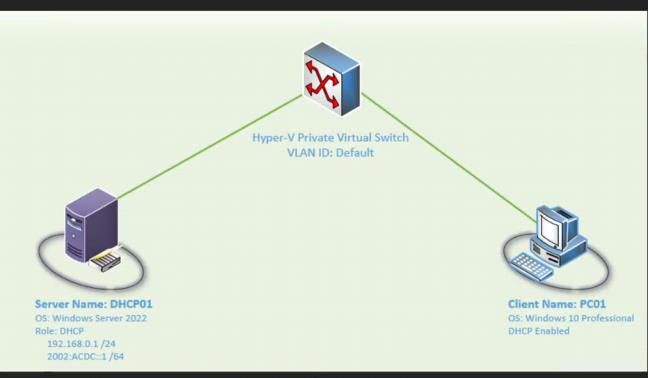{width="10.541666666666666in" height="6.15625in"}

 

 

 

Add dhcp role

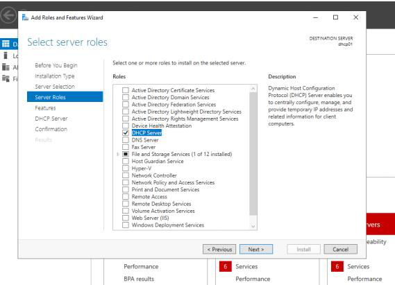{width="9.260416666666666in" height="6.6875in"}

 

 

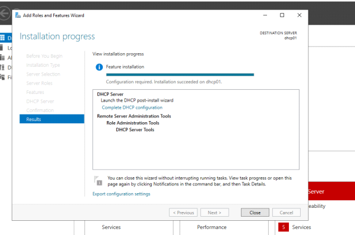{width="9.791666666666666in" height="6.489583333333333in"}

 

 

We have the DHCP role

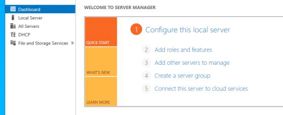{width="9.041666666666666in" height="3.6979166666666665in"}

 

Dhcp Tab

We install server role but we need to do post config

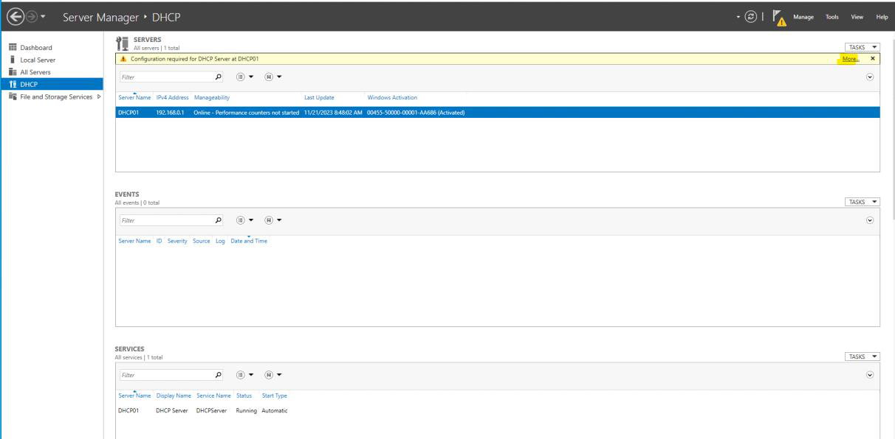{width="19.71875in" height="9.697916666666666in"}

 

 

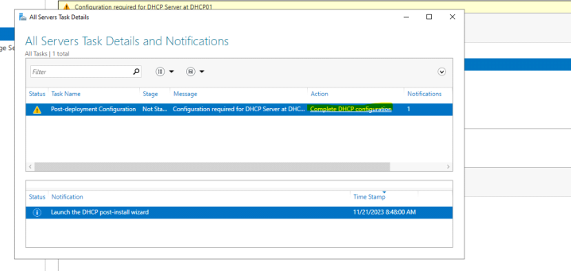{width="11.697916666666666in" height="5.5625in"}

 

This will create security group to manage DHCP

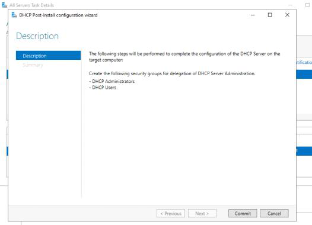{width="8.572916666666666in" height="6.1875in"}

 

Hit commit button and it will create the security group for dhcp

Hit close and we are done

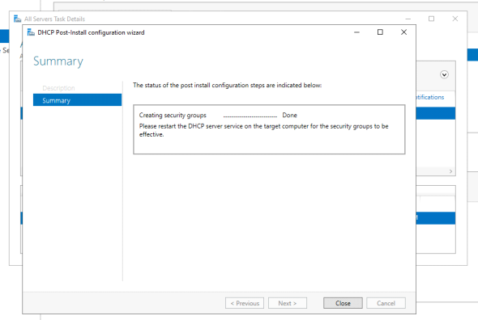{width="9.604166666666666in" height="6.4375in"}

 

Go to dhcp manager

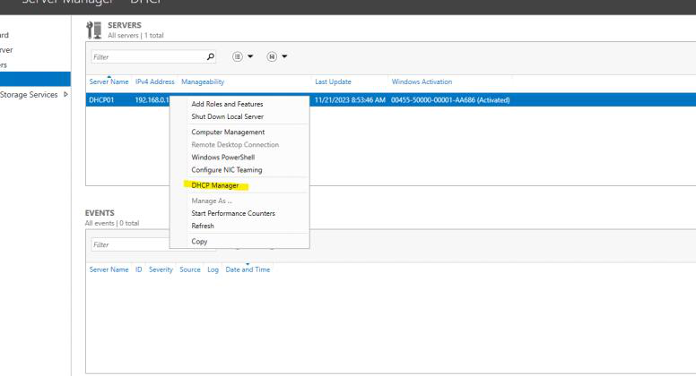{width="12.635416666666666in" height="6.84375in"}

 

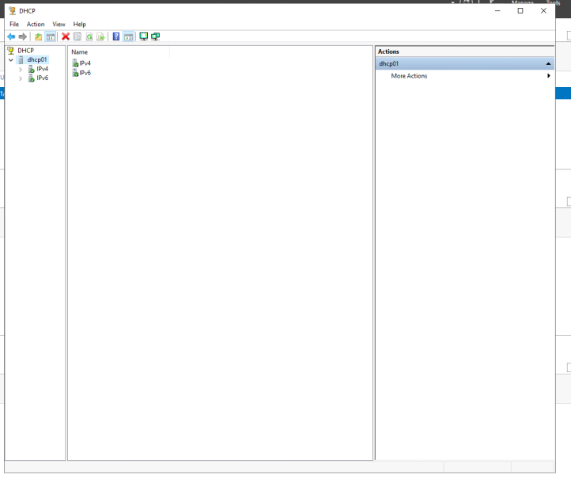{width="11.75in" height="9.854166666666666in"}

 

We need to make a DHCP scope

Which is the address pool

The pool of address that our server going to lease to client devices

Our scope

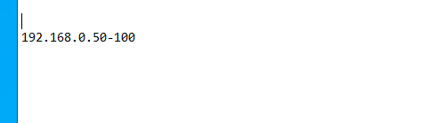{width="5.0in" height="1.4375in"}

 

Go to ipv4 option

New scope

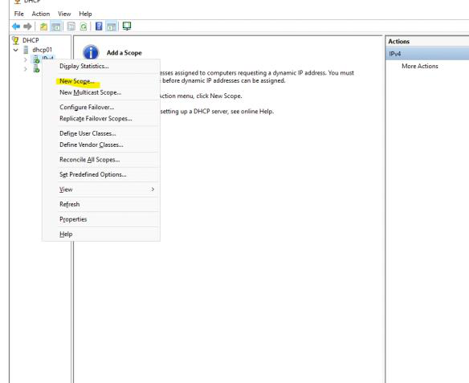{width="9.510416666666666in" height="7.770833333333333in"}

 

Name scope

Be descriptive

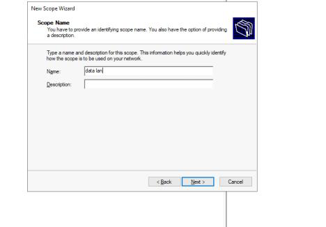{width="7.625in" height="5.28125in"}

 

Define address range

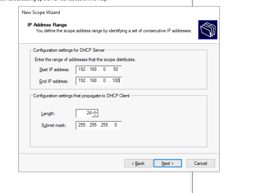{width="7.40625in" height="5.15625in"}

 

 

Address we don't want dhcp server to not hand out

None today since our pool is so small

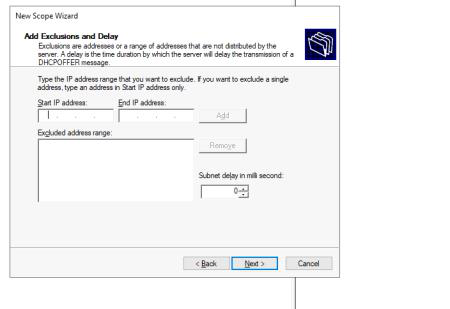{width="7.333333333333333in" height="5.03125in"}

 

Lease duration

Default is 8 days. Most circumstances it fine

Really easy to run out of address if lease set too high

Leave at 8

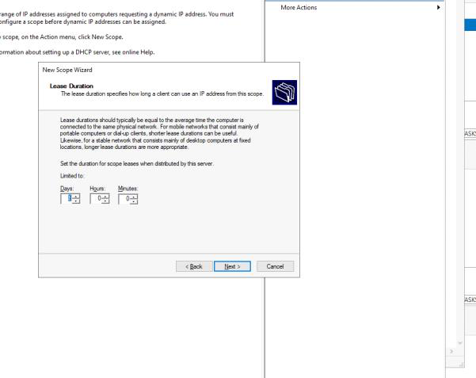{width="9.78125in" height="7.770833333333333in"}

 

 

Yes

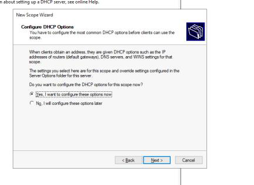{width="7.03125in" height="5.145833333333333in"}

 

 

Default gateway

We don't have one setup since we not connected to the internet

Let presume our default gateway/router is 192.168.0.254

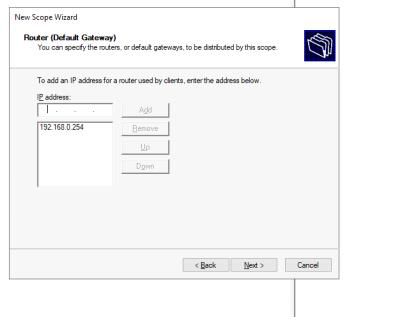{width="6.65625in" height="5.15625in"}

 

 

Giving it dns server

Gave it google dns server

By default it will hand off 192.168.0.1 as dns server

But if we want another dns server like cloudflare you can put it here

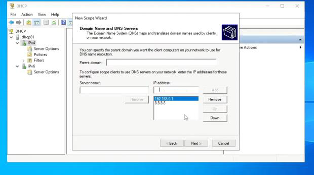{width="10.104166666666666in" height="5.645833333333333in"}

 

Wont add cause it cant confirm since we not connected to internet

Hit yes to show what it will do since this is a lab

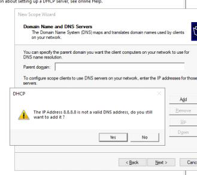{width="5.364583333333333in" height="4.78125in"}

 

WIN Server

Legacy that precede dhcp and dns

Wont be running this

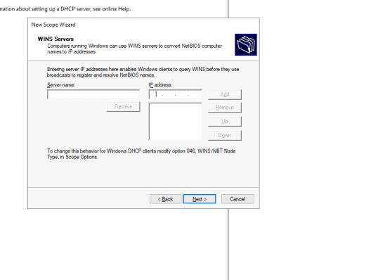{width="8.604166666666666in" height="6.489583333333333in"}

 

 

Yes

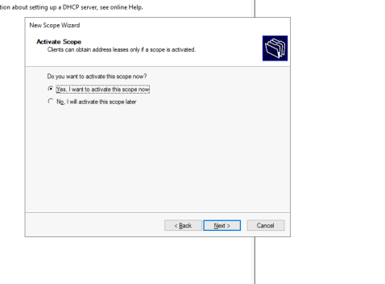{width="7.78125in" height="5.71875in"}

 

 

 

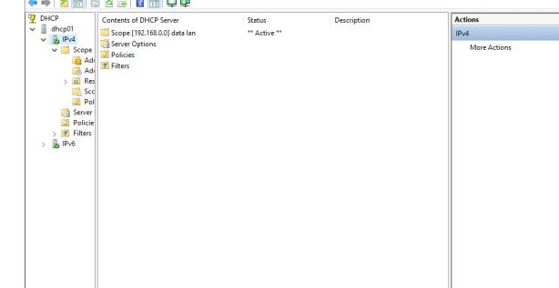{width="10.0in" height="5.177083333333333in"}

 

 

We can see our address pool

 

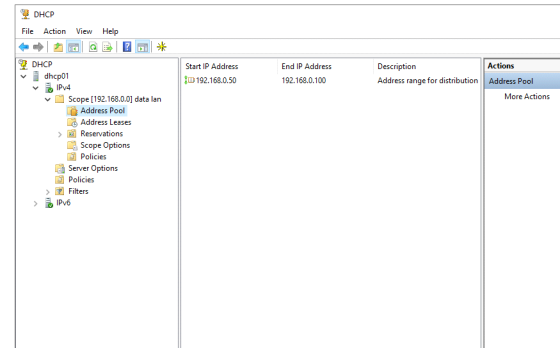{width="9.104166666666666in" height="5.65625in"}

 

 

Address leases

No address added yet

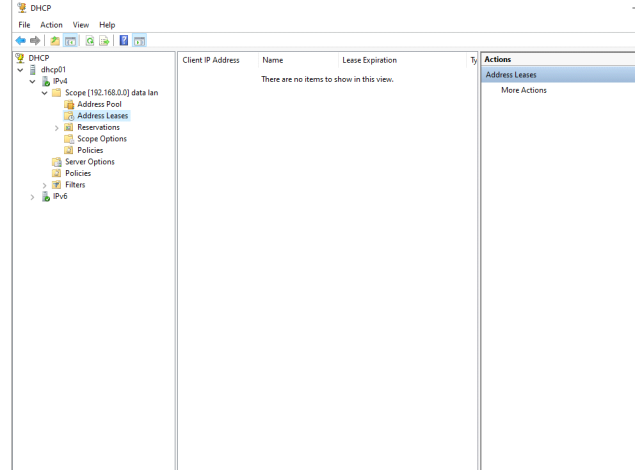{width="10.322916666666666in" height="7.65625in"}

 

 

Our scope option

Our router and dns

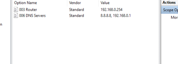{width="5.895833333333333in" height="2.1354166666666665in"}

 

Reservation

Maybe we want out computer to receive the same ip address every single time with dhcp

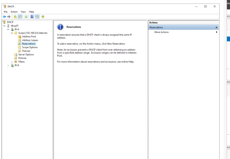{width="7.635416666666667in" height="5.28125in"}

 

Verify working

Move to test pc

 

Our ipconfig

 

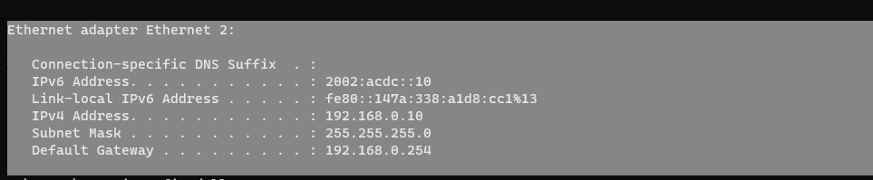{width="10.03125in" height="2.0729166666666665in"}

 

Ipconfig /all

Need to change our dns

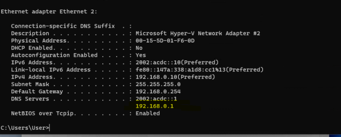{width="9.229166666666666in" height="3.7291666666666665in"}

 

Change ipv4 to automatic

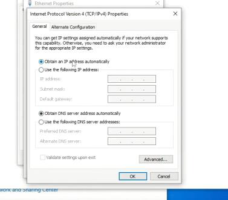{width="6.125in" height="5.375in"}

 

Now pc will start sending discovery request

{width="7.489583333333333in" height="2.84375in"}

 

 

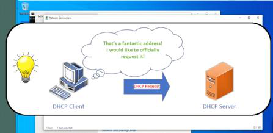{width="7.28125in" height="3.5416666666666665in"}

 

 

 

{width="7.145833333333333in" height="2.75in"}

 

We now have a dynamic assign address

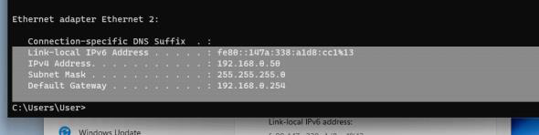{width="9.604166666666666in" height="2.4166666666666665in"}

 

 

{width="7.25in" height="2.3229166666666665in"}

 

We also see it on the lease

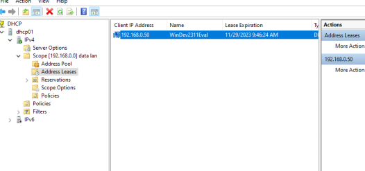{width="8.5625in" height="4.020833333333333in"}

 

 

If we want it to remain ip everytime it boots we can add are reservation

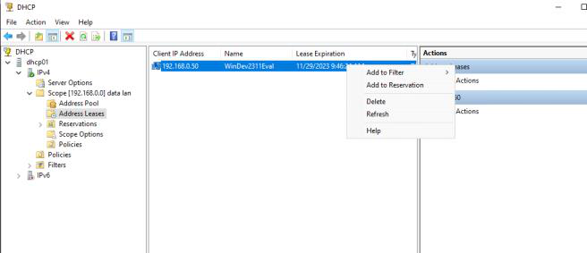{width="10.666666666666666in" height="4.614583333333333in"}

 
