Dhcp loadbalancing and failover

Thursday, November 23, 2023

11:14 AM

 

{width="11.291666666666666in" height="6.364583333333333in"}

 

Pretty rare for us to receive a dhcp dynamic address for a server so assign server with static address most of the time

Install dhcp role

And do post installation of security group

Go to dhcp manager

 

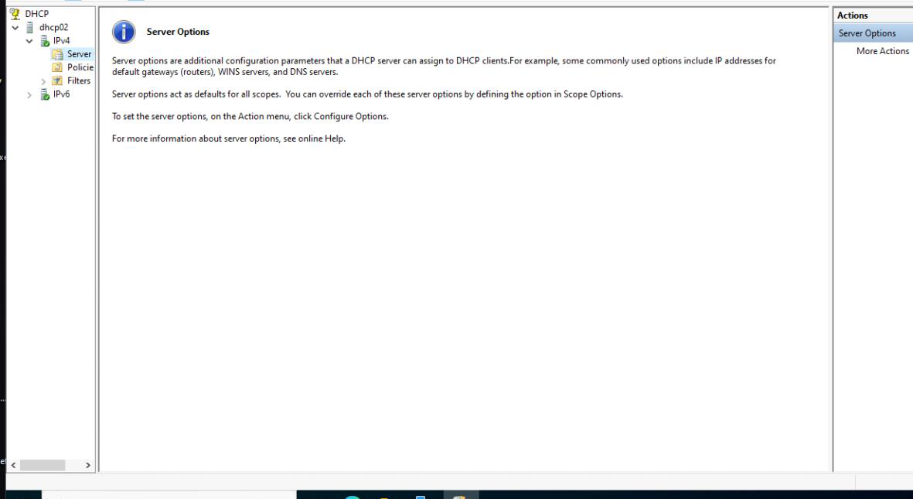{width="12.822916666666666in" height="7.0in"}

 

This server is a backup server a failover server

Go back to dchp1

Dhcp manager

Configure failover

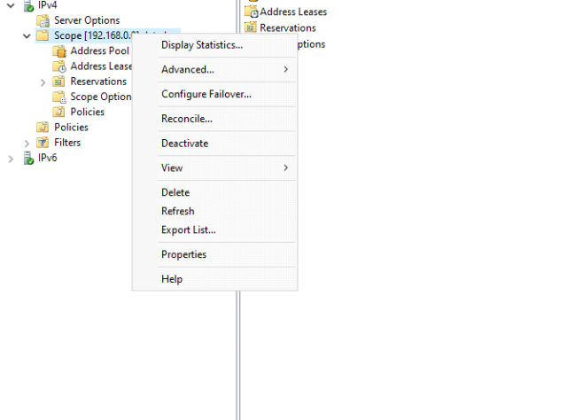{width="7.052083333333333in" height="5.15625in"}

 

Failover for this current scope 192.168.0.0

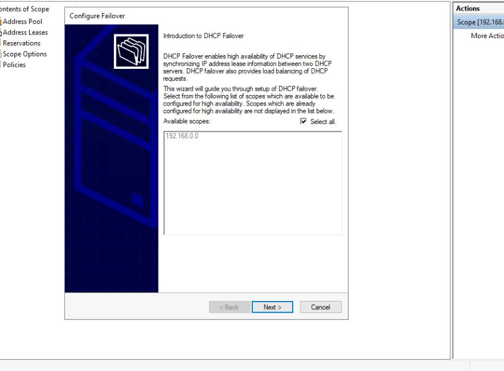{width="9.21875in" height="6.78125in"}

 

Partner server is our dhcp2

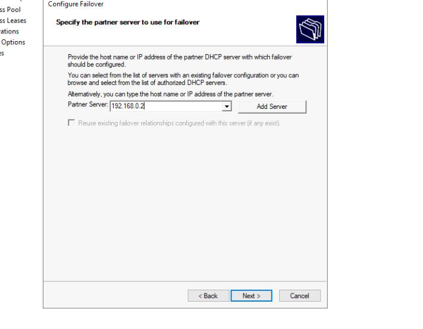{width="7.71875in" height="6.0in"}

 

Another way is to browse for it using the Add Server option

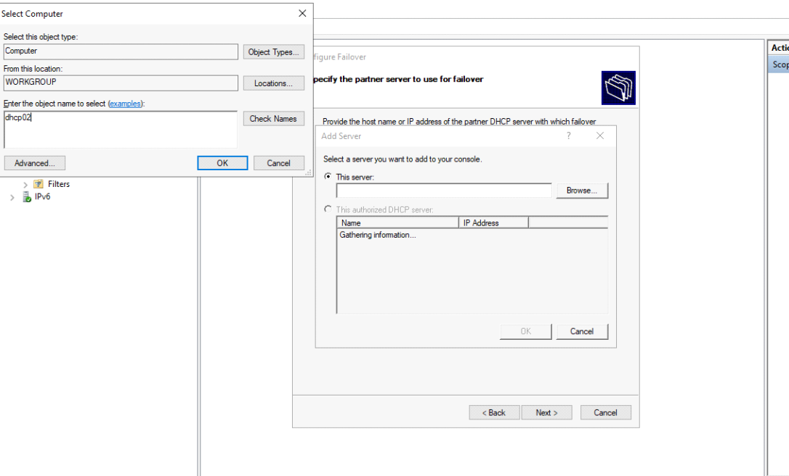{width="11.791666666666666in" height="7.125in"}

 

Click Check name and it will browse for it

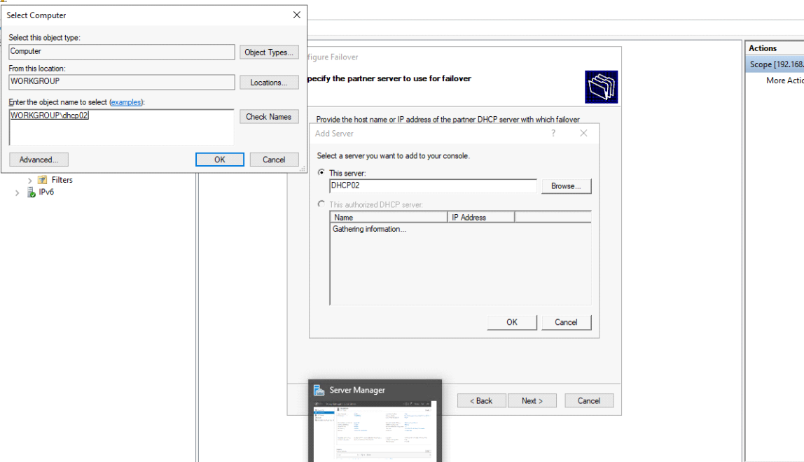{width="12.46875in" height="7.15625in"}

 

 

Now we get to name this relationship

Let explore the Mode option

Load Balance-both server will be listening for and responding to query(dhcp query response)on the network. Both running both handing out address

Hot standby-1 server doing all the query responses in the network and the second network waitng until the first 1 is not wokring

 

Prefer load balance cause better performance

{width="9.166666666666666in" height="6.4375in"}

 

Load balance percentage best practice based on your environment.

Usually people use 80:20 or 50:50

Need a share secret

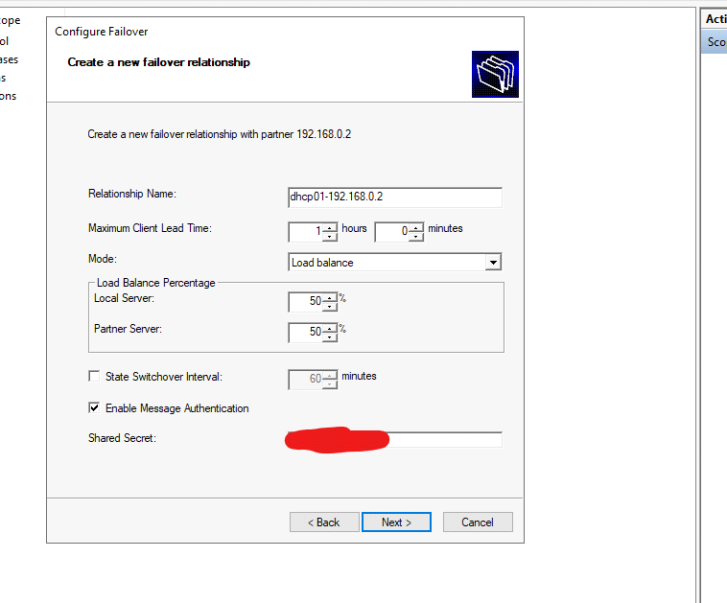{width="7.895833333333333in" height="6.552083333333333in"}

 

Our summary

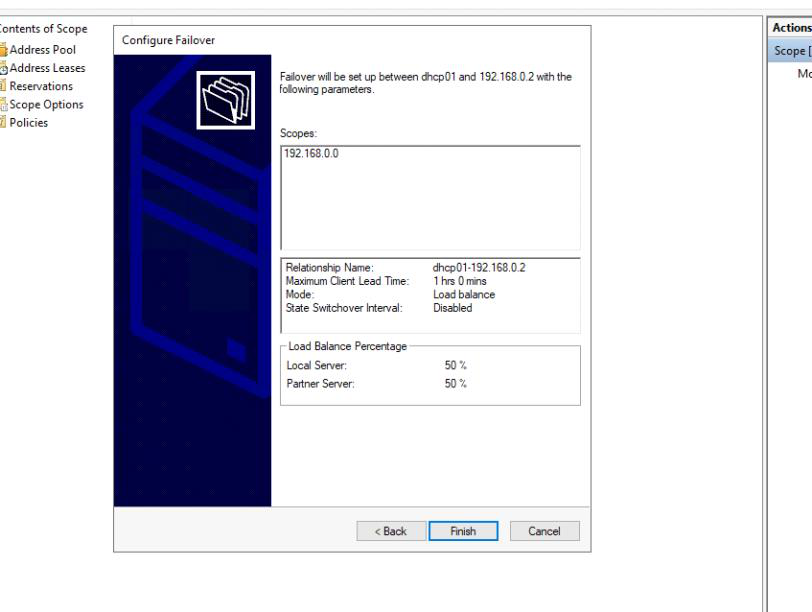{width="8.822916666666666in" height="6.645833333333333in"}

 

It now created

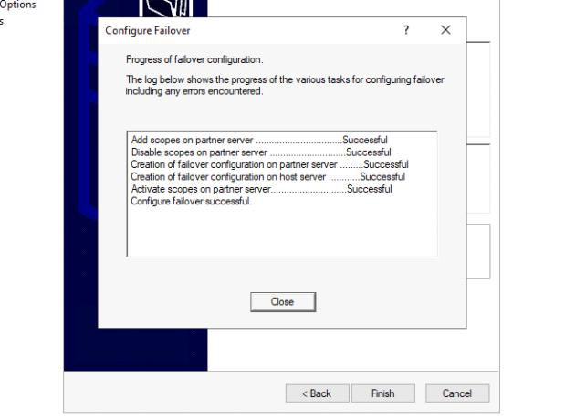{width="6.96875in" height="4.989583333333333in"}

 

Click properties to look at failover setting

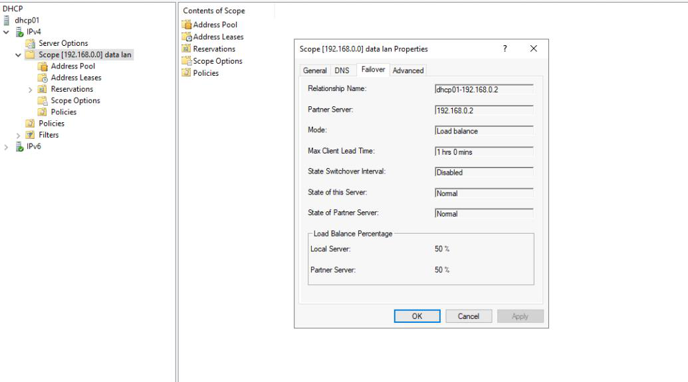{width="11.229166666666666in" height="6.25in"}

 

Go back to your dhcp02

 

Observe no scope

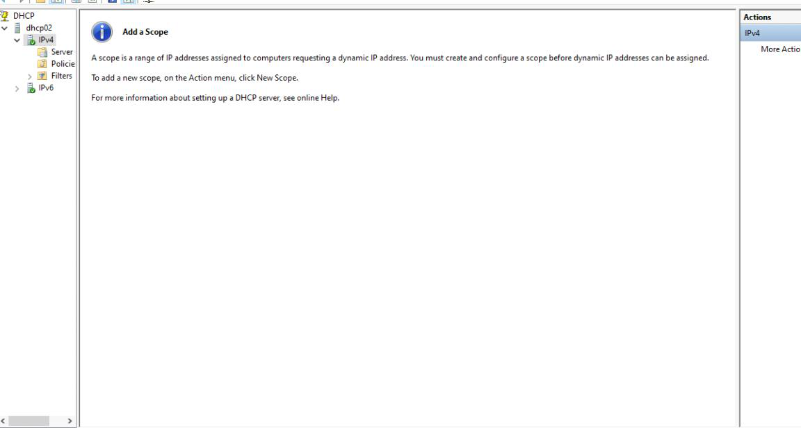{width="12.510416666666666in" height="6.6875in"}

 

Click refresh. We have scope

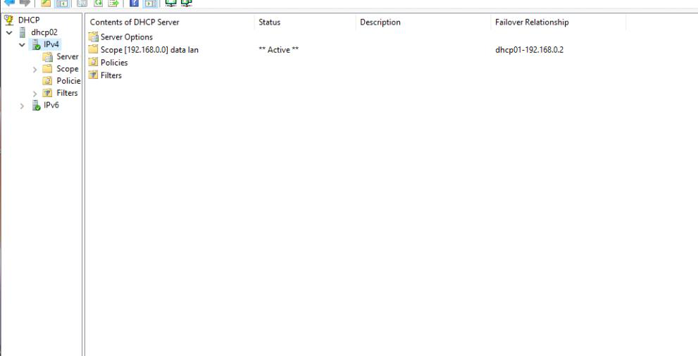{width="10.760416666666666in" height="5.5in"}

 

Let see if the failover really work

Disable network adapter on dhcp01 and see if client pc receive dhcp IP

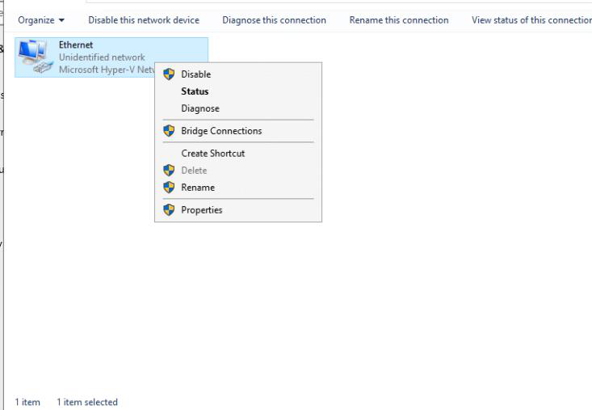{width="7.958333333333333in" height="5.5in"}

 

Force address renewal dhcp renewal

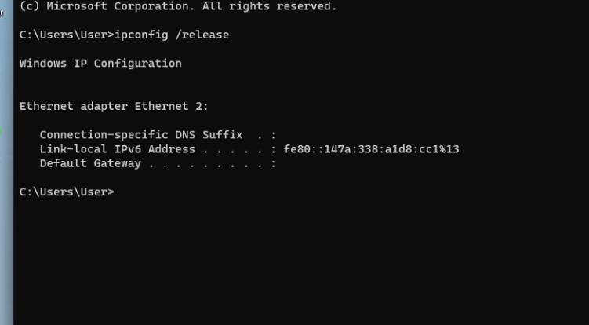{width="8.15625in" height="4.5in"}

 

Should get a address not on our dhcp

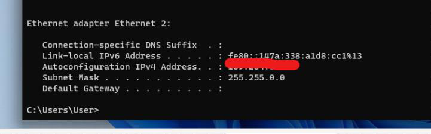{width="7.833333333333333in" height="2.4479166666666665in"}

 

 

We receive a dhcp address

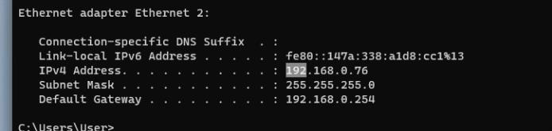{width="7.53125in" height="1.8020833333333333in"}

 

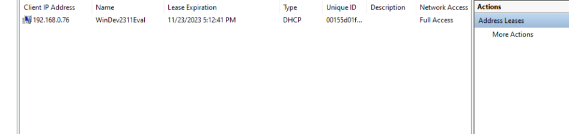{width="10.28125in" height="2.4166666666666665in"}

 

Failover work as intended

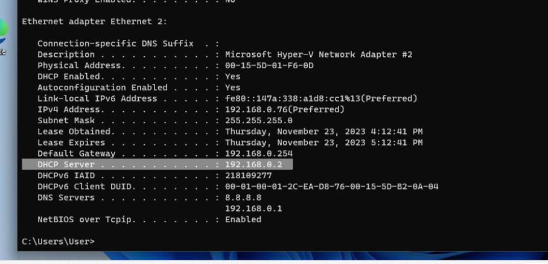{width="9.854166666666666in" height="4.75in"}

 
