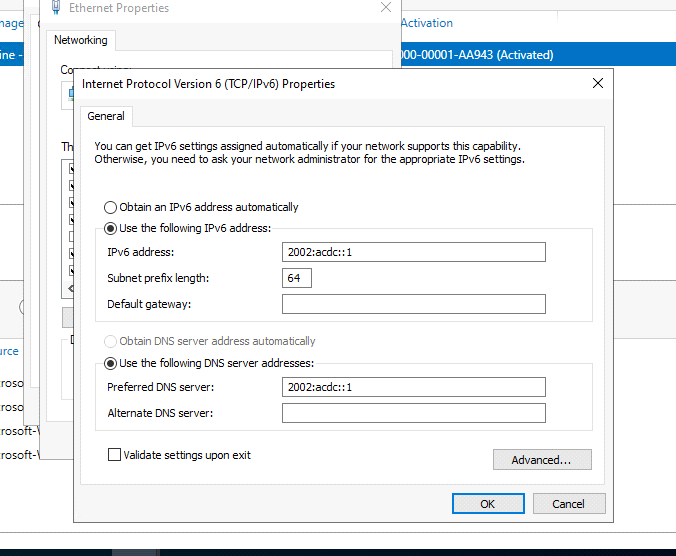
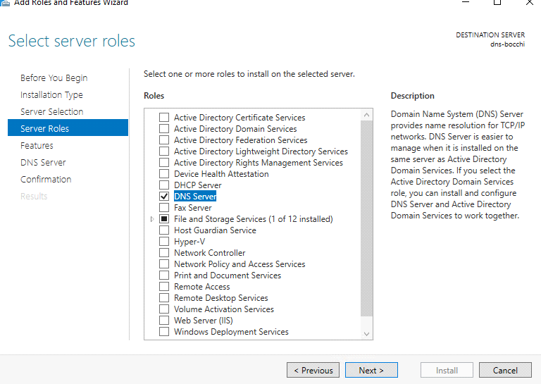
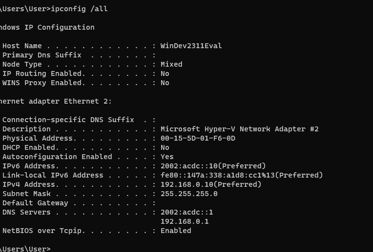

DNS standalone lab

Friday, November 17, 2023

8:06 PM

 

Change computer name

{width="7.614583333333333in" height="5.34375in"}

Our ipv4

{width="7.833333333333333in" height="5.40625in"}

 

Our ipv6

{width="7.03125in" height="5.78125in"}

 

Install dns role

We want role-based

{width="8.15625in" height="5.78125in"}

 

Server pool should match hostname and ip address

If you have a auto ip than go back and change to a static ip

{width="8.041666666666666in" height="5.6875in"}

 

 

{width="8.0in" height="5.677083333333333in"}

 

 

Remember

Don\'t restart production. See any preparation policy.

 

{width="8.0in" height="5.739583333333333in"}

 

 

Featured finish installing

{width="11.479166666666666in" height="6.083333333333333in"}

 

Use dns manager to configure

{width="7.8125in" height="5.458333333333333in"}

 

 

No zone

We don't have a authoritative source for anything

Will be namespace for bocchi.com

Dns resolve query.

Translate a name of machine,host with its ip address(forward lookup)

Name of something and find ip address

We need to make a forward lookup zone for this

{width="7.75in" height="5.4375in"}

 

New zone

{width="8.28125in" height="5.53125in"}

 

 

We want primary zone

{width="7.78125in" height="5.5625in"}

 

Make a namespace

{width="8.166666666666666in" height="5.78125in"}

 

 

 

{width="7.65625in" height="5.5625in"}

 

 

We want do not ally dynamic update since it a standalone

{width="7.71875in" height="5.427083333333333in"}

 

 

We created a zone

{width="7.864583333333333in" height="5.375in"}

 

Open up further to explore the record

SOA and NS

{width="7.375in" height="5.3125in"}

 

We need a name server for the SOA

{width="8.40625in" height="6.125in"}

 

Edit

{width="8.104166666666666in" height="5.75in"}

 

 

Resolve

Found valid name server on ipv4 and ipv6

Click ok and apply

{width="7.958333333333333in" height="5.5625in"}

 

 

Do the same for NS

{width="7.364583333333333in" height="5.6875in"}

 

 

 

 

Set up a A record that let other machine identify the name of this machine

 

New host

{width="10.59375in" height="8.375in"}

 

 

Will create a FQDN

bocchi.com has a machine name dns-bocchi

The fqdn is dns-bocchi.bocchi.com

The ip address should match your static ip

PTR is the reverse lookup(translate ip address to domain) havent created yet.

Click ok and apply

{width="4.78125in" height="4.78125in"}

 

 

{width="7.6875in" height="5.53125in"}

 

Check with nslookup

{width="9.03125in" height="5.03125in"}

 

 

Resolved and successful

{width="6.5625in" height="2.15625in"}

 

 

Craft our lookup by eliminating ipv6 so that ipv4 can respond

 

{width="6.5625in" height="2.15625in"}

 

 

Did resolve but we got a unknown. Will resolve this soon

{width="6.71875in" height="1.96875in"}

 

 

Let make one for IPV6

New host

{width="6.4375in" height="6.625in"}

 

 

 

{width="8.385416666666666in" height="5.302083333333333in"}

 

Now we got a a record and a AAAA record

{width="7.84375in" height="4.90625in"}

 

Running nslookup shows that we have two addresses

Still unkown

Reason: we don't have reverse lookup zone

{width="6.84375in" height="2.1979166666666665in"}

 

Reverse lookup let you take a ip and translate it to a machine name

Create reverse lookup zone

{width="7.65625in" height="5.5625in"}

 

{width="6.083333333333333in" height="4.489583333333333in"}

 

IPV4

{width="7.958333333333333in" height="5.583333333333333in"}

 

{width="7.84375in" height="5.90625in"}

 

Our file created

{width="7.833333333333333in" height="5.458333333333333in"}

 

 

{width="5.708333333333333in" height="4.71875in"}

 

{width="7.75in" height="5.489583333333333in"}

 

We now created a reverse lookup zone

{width="7.802083333333333in" height="5.40625in"}

 

Go to NS properties

Looks like it not resolving

{width="7.78125in" height="5.333333333333333in"}

 

 

Click edit and resolve

Server resolve itself

Do the same of SOA

{width="5.875in" height="5.28125in"}

 

 

Now we can add PTR record

{width="9.104166666666666in" height="6.625in"}

 

Create a new PTR record

Enter host ip

Than browse for Hostname and you should see your host

{width="7.59375in" height="5.0in"}

 

Browse into that and you should see your host

{width="7.9375in" height="4.90625in"}

 

{width="7.875in" height="5.4375in"}

 

 

Now have forward and reverse record

{width="7.4375in" height="3.09375in"}

 

 

Resolve unknown

{width="7.5in" height="2.59375in"}

 

Now let enter ipv6

Unknown for ipv6

{width="7.40625in" height="2.2291666666666665in"}

 

Let repeat the step to add ipv6 reverse lookup

New Zone

 

 

{width="7.927083333333333in" height="5.333333333333333in"}

 

{width="7.770833333333333in" height="5.520833333333333in"}

 

{width="7.8125in" height="5.25in"}

 

 

{width="7.895833333333333in" height="5.15625in"}

 

 

{width="8.34375in" height="5.71875in"}

 

 

{width="8.041666666666666in" height="5.46875in"}

 

{width="7.15625in" height="5.270833333333333in"}

 

 

 

Go back to forward zone and right click AAAA record

Properties

Update PTR record

{width="5.625in" height="5.28125in"}

 

Going back to reverse lookup we should see a PTR record

{width="7.84375in" height="5.21875in"}

 

Validate SOA

Properties

Resolve

{width="8.010416666666666in" height="5.770833333333333in"}

 

 

{width="8.8125in" height="5.25in"}

 

Do the same for NS

 

Nslookup again to validate

{width="7.65625in" height="2.1354166666666665in"}

 

 

To test on a remote pc

{width="7.958333333333333in" height="5.395833333333333in"}

 

 

 

Our nslookup successful

{width="7.364583333333333in" height="2.1666666666666665in"}

 

Let find if our pc is on this dns

Nope we don't have a record

{width="7.333333333333333in" height="2.03125in"}

 

We can add our pc by going back to our dns manager

Add A record

 

{width="7.125in" height="4.270833333333333in"}

 

 

{width="8.385416666666666in" height="6.59375in"}

 

Since we already have our reverse lookup setup we can see it being added

{width="8.0625in" height="5.09375in"}

 

 

 

Going back to our test pc

Success now we know our test pc is part of the dns

{width="7.625in" height="2.2916666666666665in"}

 

 

 

Let do the same for ipv6

 

New host

{width="7.375in" height="4.03125in"}

 

 

 

{width="4.59375in" height="4.96875in"}

 

 

{width="6.5in" height="2.84375in"}

 

 

Success

{width="7.114583333333333in" height="2.1979166666666665in"}

 

 

{width="8.572916666666666in" height="2.8229166666666665in"}

 

{width="9.416666666666666in" height="2.0729166666666665in"}

 

We just setup a standalone dns

 
