DHCP Secondary

Saturday, November 18, 2023

2:59 PM

 

Setting up secondary dhcp

Client wont have to go to lengthly network for answer

It will instead listen to dns-bacon which will listen to dns-egg

 

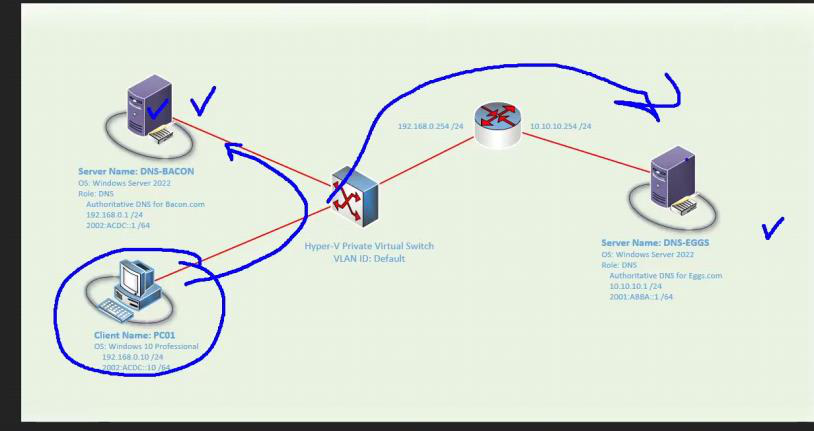{width="12.822916666666666in" height="6.78125in"}

> 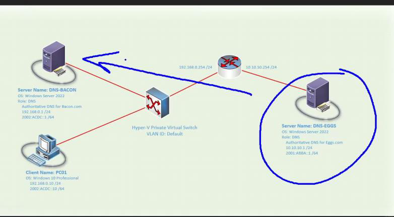{width="12.3125in" height="6.78125in"}

 

 

Our second dns

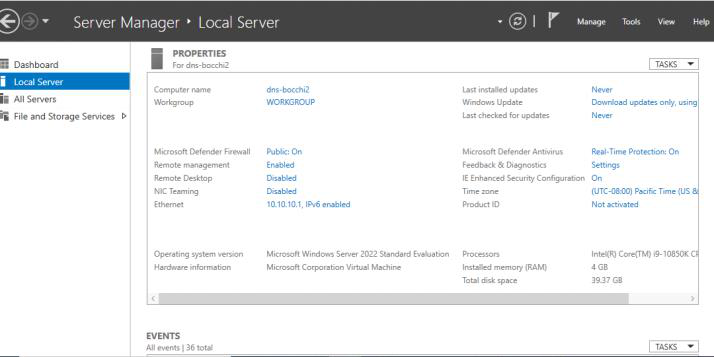{width="11.25in" height="5.625in"}

 

Install dns role

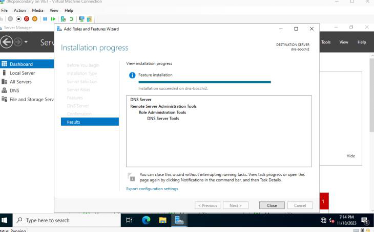{width="11.510416666666666in" height="7.15625in"}

 

 

 

Create new forward zone for second dns

 

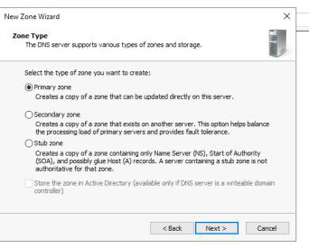{width="5.395833333333333in" height="4.333333333333333in"}

 

 

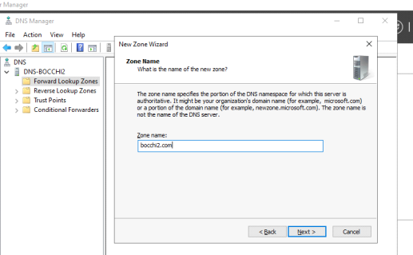{width="8.135416666666666in" height="5.03125in"}

 

 

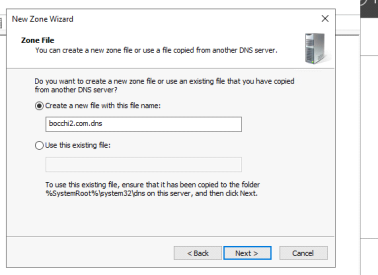{width="5.958333333333333in" height="4.34375in"}

 

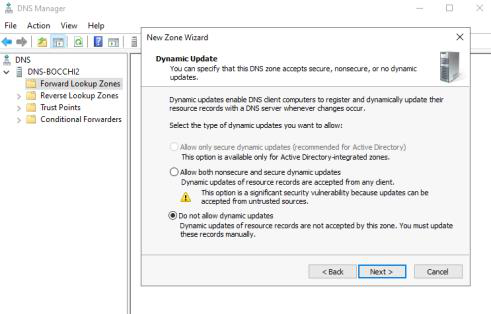{width="7.739583333333333in" height="4.958333333333333in"}

 

We now have SOA and NS that need to be Resolve

 

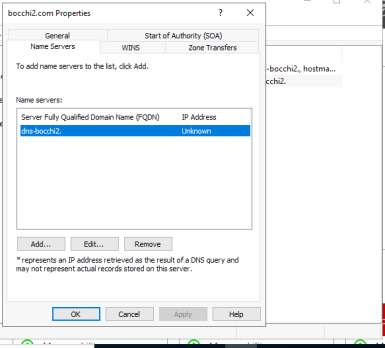{width="6.0625in" height="5.46875in"}

 

Ok and apply

Resolve for SOA too

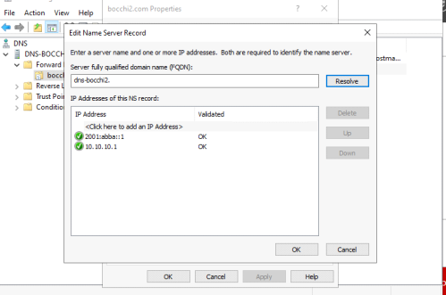{width="7.864583333333333in" height="5.21875in"}

 

 

Add A record for the server

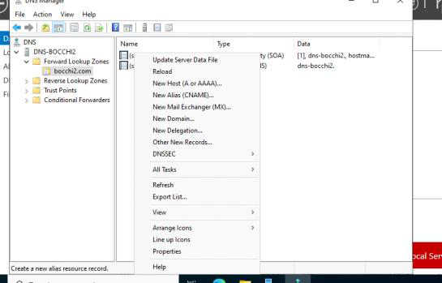{width="8.59375in" height="5.5in"}

 

Remember we cant add PTR record yet

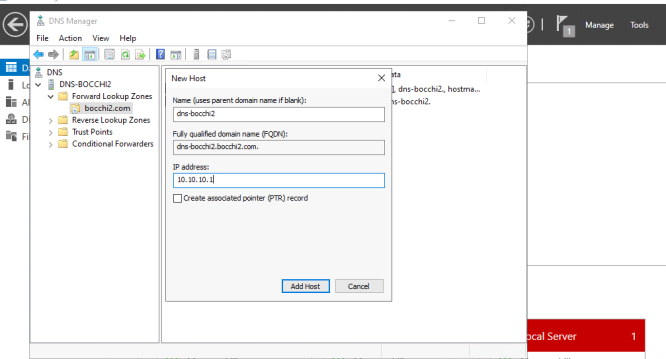{width="10.479166666666666in" height="5.65625in"}

 

 

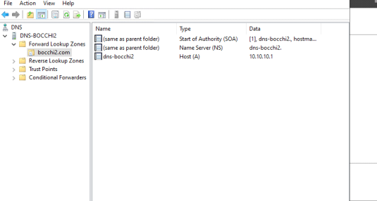{width="8.416666666666666in" height="4.5in"}

 

 

Create reverse lookup zone for IPV4 and IPV6

 

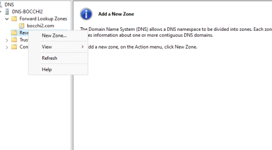{width="7.21875in" height="4.0in"}

 

 

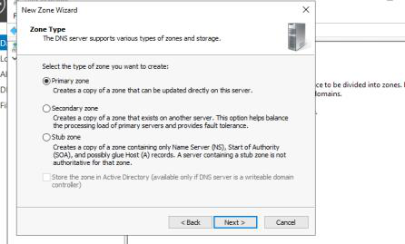{width="7.03125in" height="4.25in"}

 

 

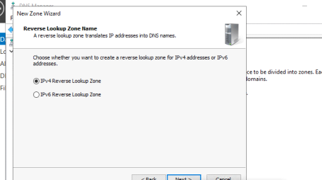{width="7.15625in" height="4.0in"}

 

 

 

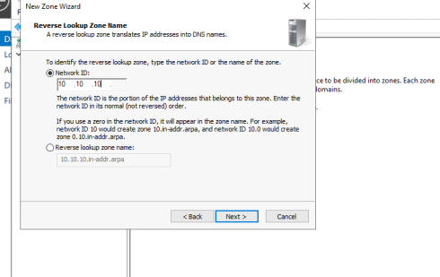{width="7.71875in" height="4.875in"}

 

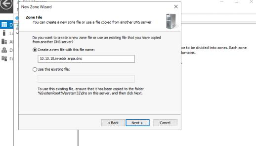{width="8.166666666666666in" height="4.65625in"}

 

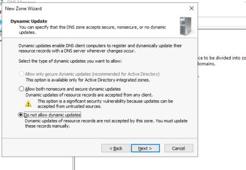{width="6.5in" height="4.5in"}

 

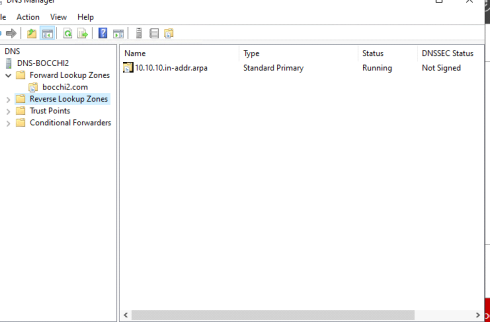{width="7.71875in" height="5.083333333333333in"}

 

Now we can add our PTR record for forward lookup

Apply

Ok

 

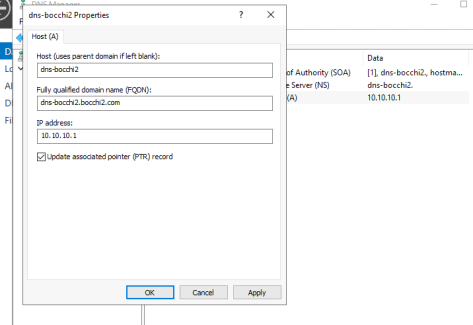{width="7.458333333333333in" height="5.125in"}

 

There are PTR

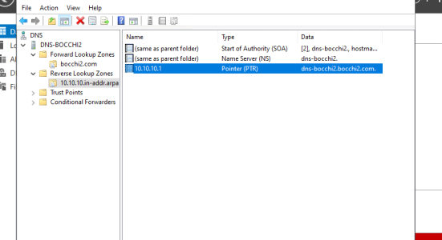{width="8.6875in" height="4.71875in"}

 

 

Do the same for IPV6

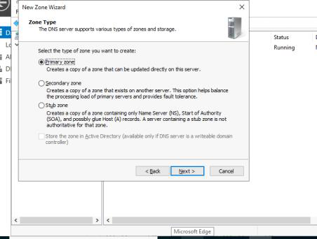{width="7.125in" height="5.395833333333333in"}

 

 

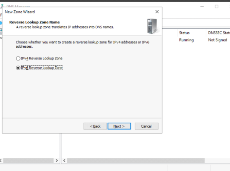{width="7.458333333333333in" height="5.53125in"}

 

 

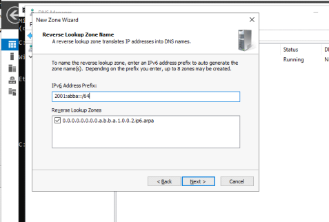{width="7.520833333333333in" height="5.083333333333333in"}

 

 

 

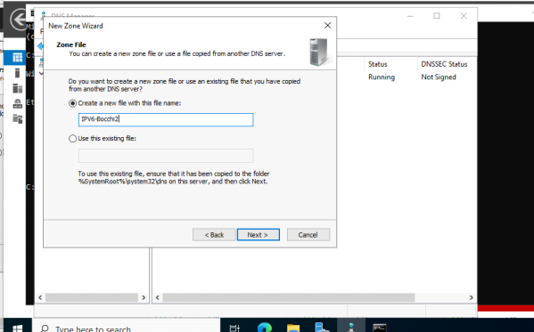{width="9.4375in" height="5.875in"}

 

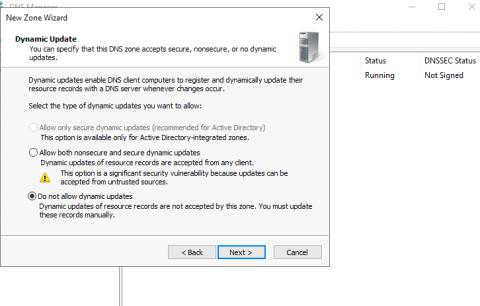{width="7.5625in" height="4.8125in"}

 

Now we need to make a AAAA record for forward lookup zone

 

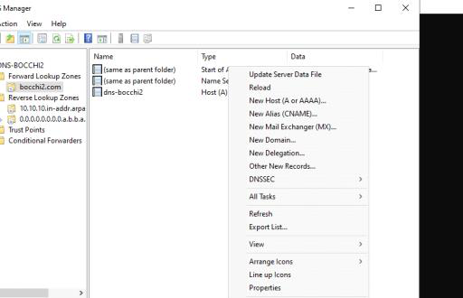{width="8.072916666666666in" height="5.208333333333333in"}

 

 

 

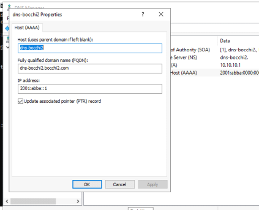{width="6.65625in" height="5.40625in"}

 

 

 

Now we need to verify

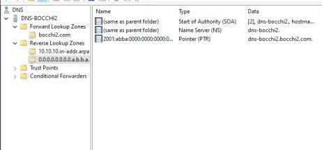{width="7.28125in" height="3.40625in"}

 

Working great

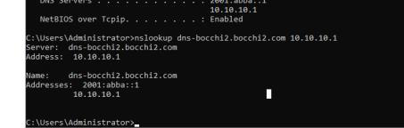{width="7.125in" height="2.2604166666666665in"}

 

Now we need to transfer this second dns to our first dns

Bocchi2 to bocchi

Same concept

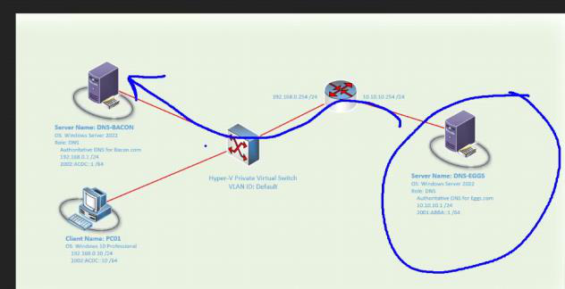{width="9.947916666666666in" height="5.114583333333333in"}

 

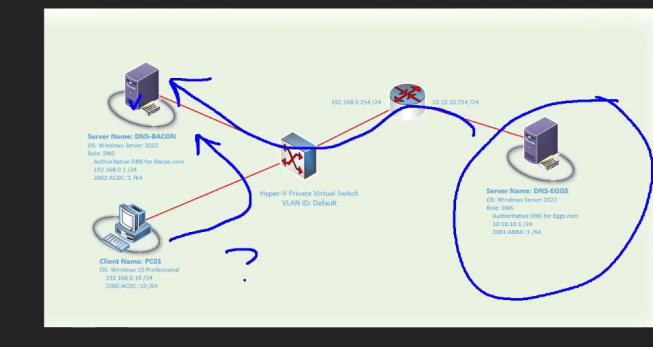{width="10.291666666666666in" height="5.46875in"}

We need to configure Zone transfer

Give permission from second dns to first dns

 

Go to properties

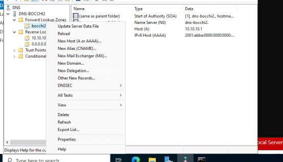{width="8.729166666666666in" height="5.0in"}

 

 

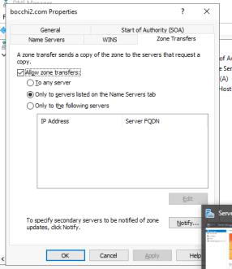{width="4.5in" height="5.21875in"}

 

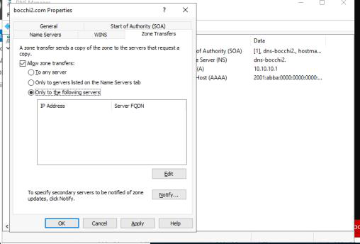{width="8.010416666666666in" height="5.427083333333333in"}

 

Click edit

Add our first dns ipv4 and ipv6

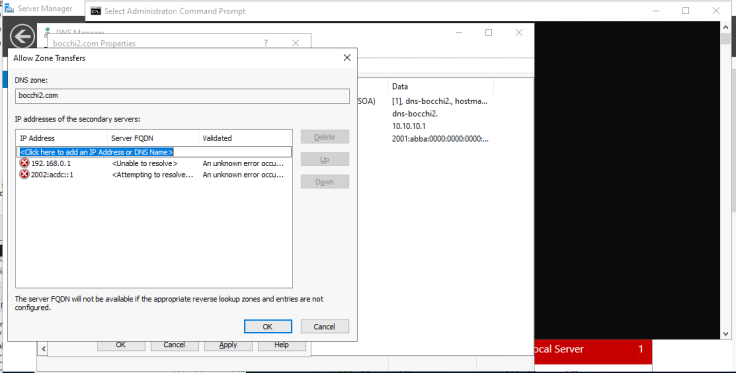{width="11.59375in" height="5.875in"}

 

We get red x\'s which mean we are unable to resolve. It only looking at record at it own zone. These record don't exist on this server. Click ok

 

Now it need permission from dns 1

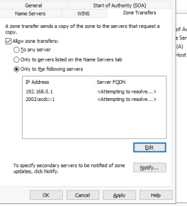{width="4.3125in" height="4.75in"}

 

 

Go back to dns 1. We need a secondary zone

New zone

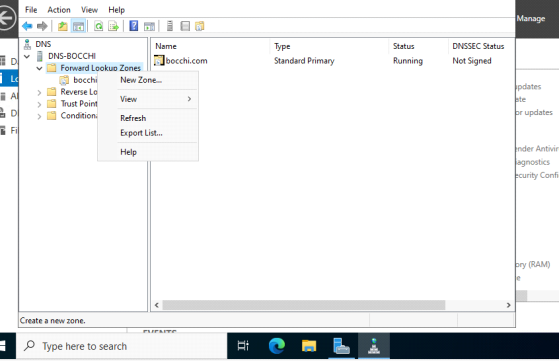{width="8.8125in" height="5.6875in"}

 

 

 

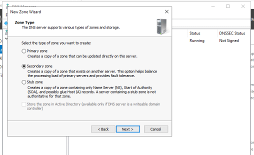{width="8.010416666666666in" height="4.875in"}

 

Give it the second zone name. IT HAS TO MATCH WHATEVER ZONE YOU COPYING FROM.

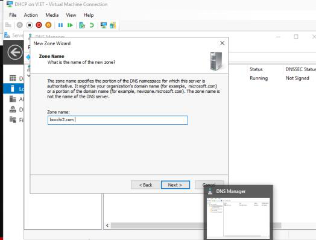{width="8.260416666666666in" height="6.270833333333333in"}

 

 

Setting up NAT

New-VMSwitch -SwitchName LabSwitch -SwitchType Internal

New-NetIPAddress -IPAddress 192.168.0.1 -PrefixLength 24 -InterfaceIndex 29

New-NetNat -name LabNAT -InternalIPInterfaceAddressPrefix 192.168.0.0/24

 

Add as default gateway 192.168.0.1

 

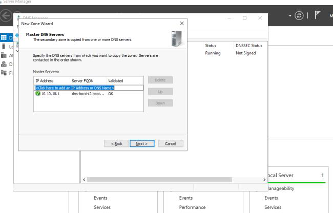{width="10.229166666666666in" height="6.5625in"}

 

 

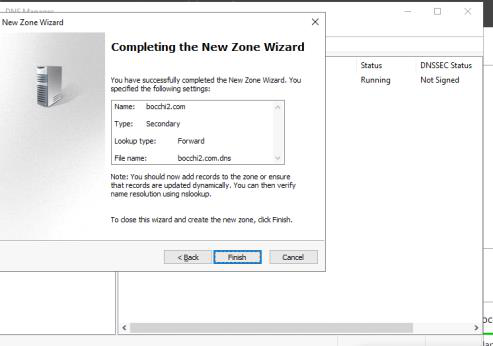{width="7.770833333333333in" height="5.4375in"}

 

 

Here our copy

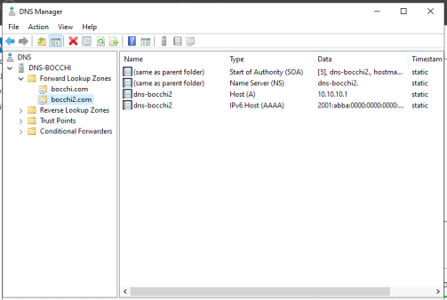{width="7.927083333333333in" height="5.333333333333333in"}

 

Doing nslookup on our test pc successful

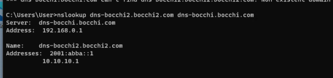{width="8.5625in" height="2.0104166666666665in"}

 

Not successful

Need to configure reverse lookup and do the same thing as previous on first dns

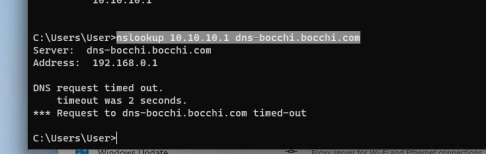{width="7.65625in" height="2.4166666666666665in"}

 

 

 

 

Properties

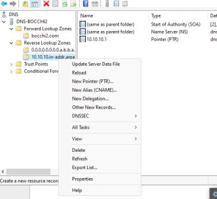{width="5.739583333333333in" height="5.270833333333333in"}

 

 

Edit

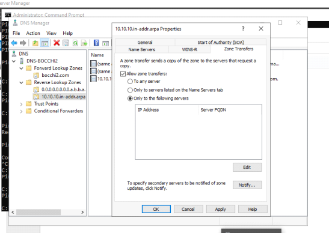{width="8.625in" height="6.125in"}

 

 

Add the ip of the first dns

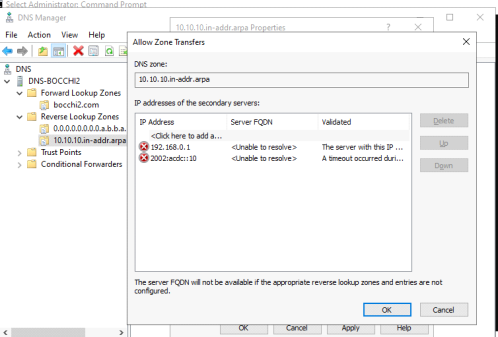{width="7.84375in" height="5.3125in"}

 

Apply ok

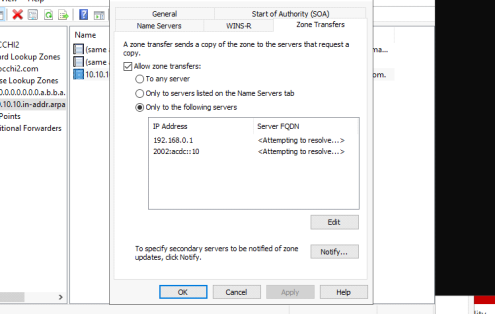{width="7.802083333333333in" height="4.9375in"}

 

Do the same for IPV6

 

Now we can do a new zone lookup on our first dns

New zone

{width="7.59375in" height="4.9375in"}

 

{width="8.322916666666666in" height="5.0625in"}

 

 

 

 

{width="8.21875in" height="5.708333333333333in"}

 

{width="8.760416666666666in" height="5.989583333333333in"}

 

{width="6.270833333333333in" height="4.8125in"}

 

Finish

{width="7.71875in" height="4.375in"}

 

Do the same for ipv6

 

We now setup a primary dns with a secondary zone

{width="8.729166666666666in" height="6.177083333333333in"}

 

Test

 

Add a A record on dns 2

{width="8.885416666666666in" height="6.395833333333333in"}

 

On dns 1 refresh and you should see your test A record

 

{width="19.0625in" height="6.5625in"}

 
