Active directory

Saturday, November 25, 2023

1:45 PM

 

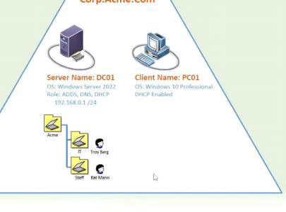{width="6.5in" height="4.8125in"}

 

Add ADDS role

 

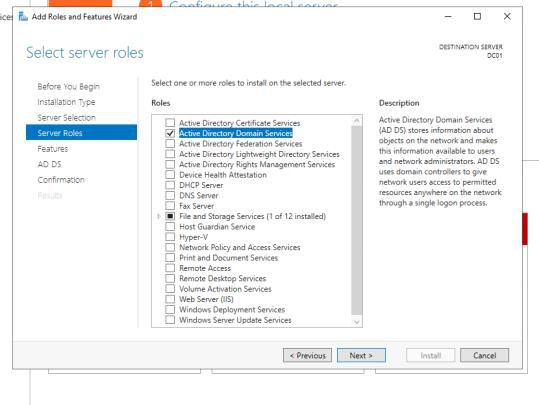{width="8.635416666666666in" height="6.5in"}

This will also add Group Policy management

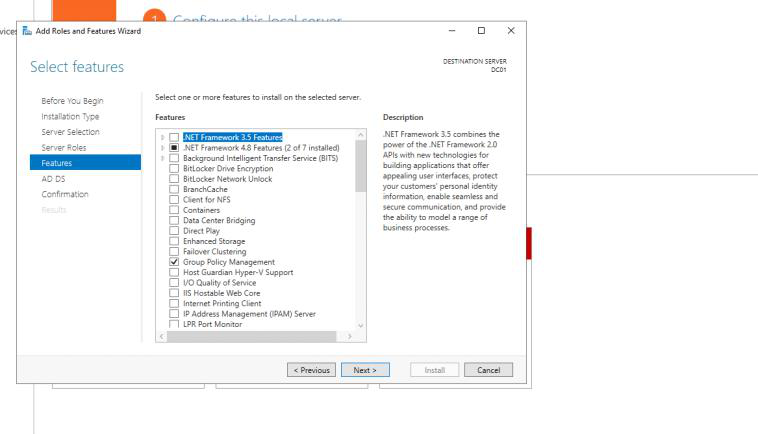{width="12.15625in" height="6.96875in"}

 

Will recommend redundancy. So it recommend two DC

Also tell you need DNS

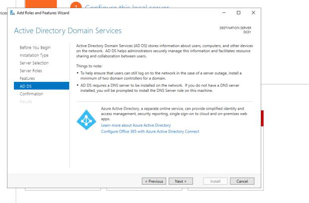{width="9.947916666666666in" height="6.5625in"}

 

AD require a restart

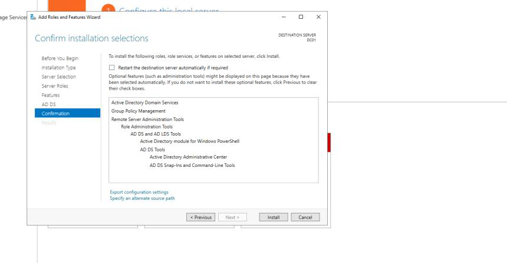{width="13.791666666666666in" height="7.15625in"}

 

Install!

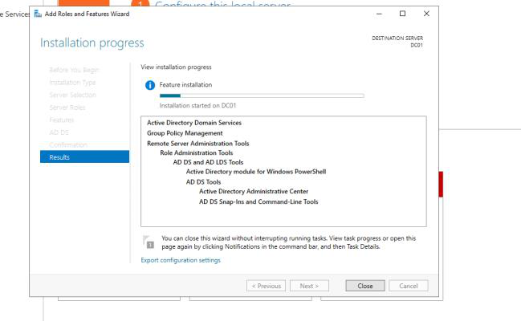{width="10.40625in" height="6.427083333333333in"}

 

 

 

Promote to domain controller

Now we have AD install we need to create the environment which need a restart

Click the Promote

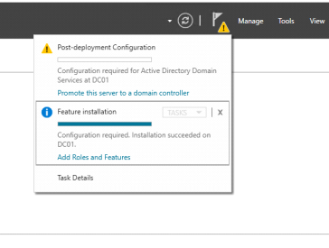{width="5.84375in" height="4.40625in"}

 

Name this domain

Assume existing domain so we will add a new forest

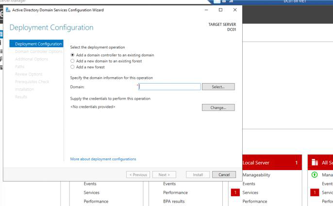{width="11.010416666666666in" height="6.8125in"}

 

 

Best practice to name domain

Follow the Microsoft best practice

Take a register name space and prepend it as a subdomain

Example: int.acme.com

There will be domain where the admin will match the name space domain with there external name space

Acme.com on the web and match it AD domain

If you do that you need extra config such as split brain dns. Not doing that for this

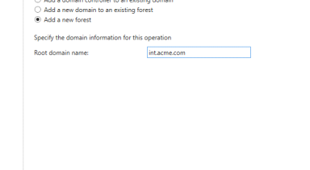{width="6.15625in" height="3.3854166666666665in"}

 

 

Select functional level

This is for backward compatibility

This will compromise the functionality the further you go back.

So we will go 2016

Give install a dsrm

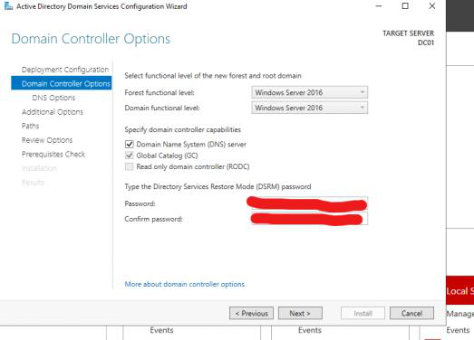{width="8.385416666666666in" height="6.03125in"}

 

Discover we don't have DNS

This will install DNS for us right here

Click next

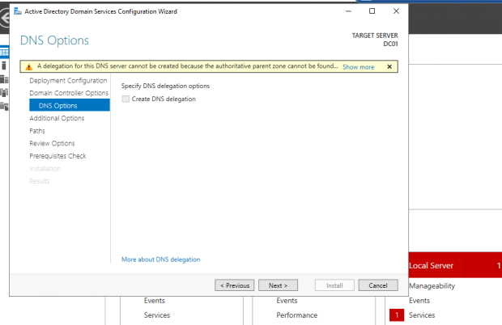{width="9.947916666666666in" height="6.458333333333333in"}

 

 

Netbios name

Will pull from our prepend name space

We don't want this to be our name space so we will change it to a more sensible name for user

ACME

 

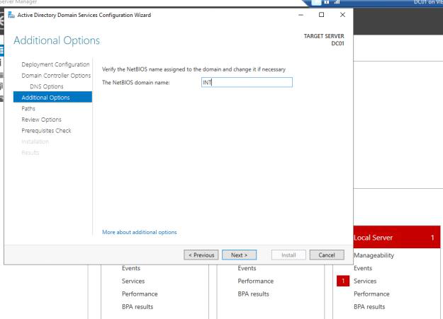{width="10.03125in" height="7.239583333333333in"}

 

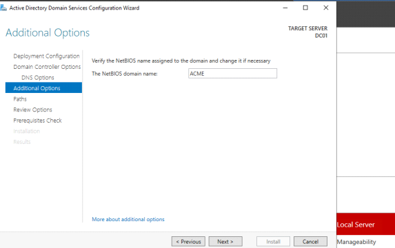{width="9.1875in" height="5.78125in"}

 

 

Will create database

Click next

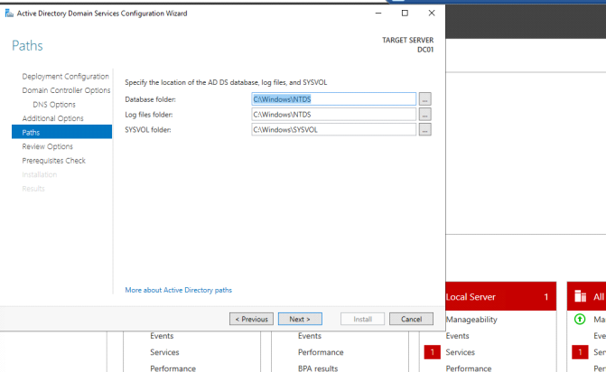{width="10.760416666666666in" height="6.625in"}

 

 

 

Now have a summary of installation

We can export this and install it via powershell

next

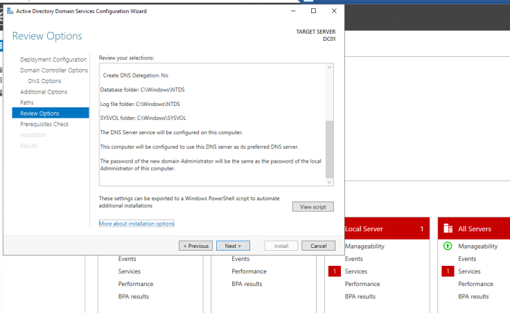{width="11.8125in" height="7.25in"}

 

 

Couple thing yellow warning but the most important is that we passed all prerequisite check

Click install

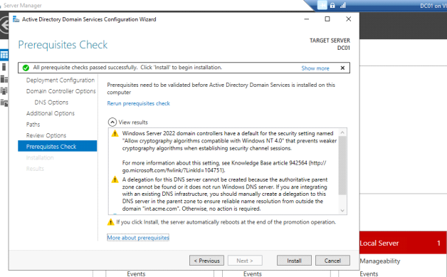{width="10.072916666666666in" height="6.25in"}

 

Will reboot and we have AD

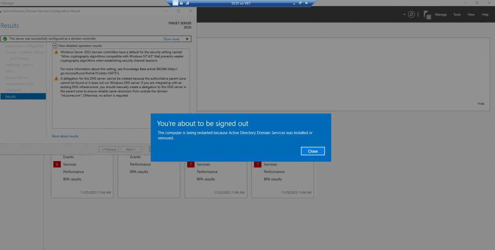{width="19.427083333333332in" height="9.84375in"}

 

 

Sign in as administrator

This is the DA(domain administrator which is set by default)

 

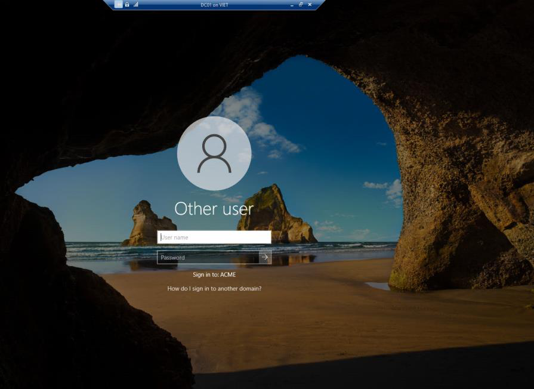{width="14.354166666666666in" height="10.447916666666666in"}

 

Notice that the server has a domain now

Also have DNS install

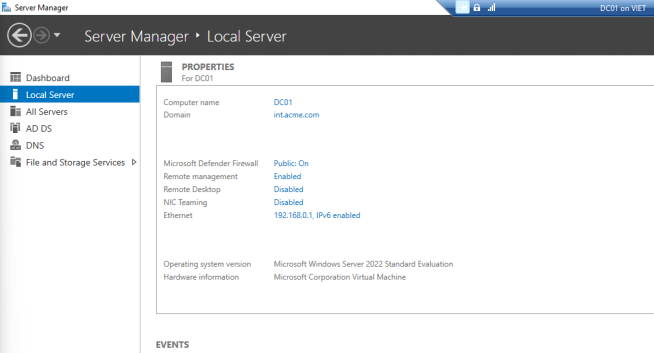{width="10.5in" height="5.65625in"}

 

New AD

Tool

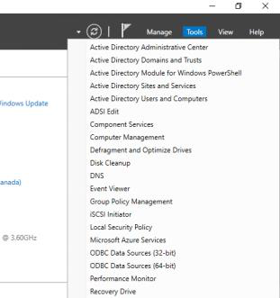{width="4.989583333333333in" height="5.3125in"}

 

Let verify DNS

Go to Dns manager

Have forward lookup constructed for us already

Including A record

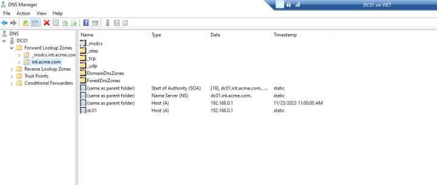{width="11.5625in" height="4.90625in"}

 

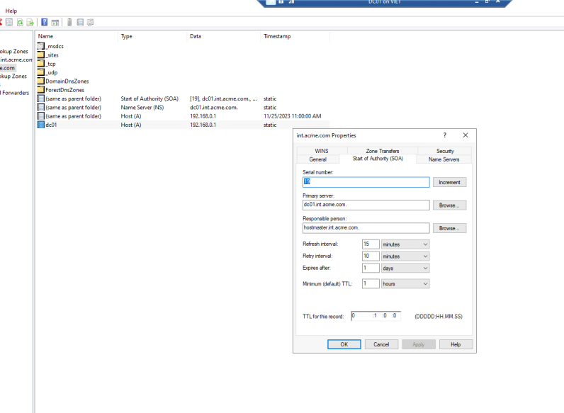{width="12.760416666666666in" height="9.354166666666666in"}

 

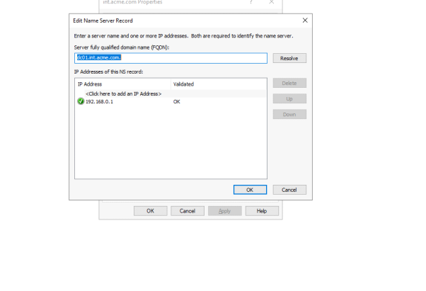{width="9.65625in" height="6.59375in"}

 

 

It has not created reverse lookup zone

 

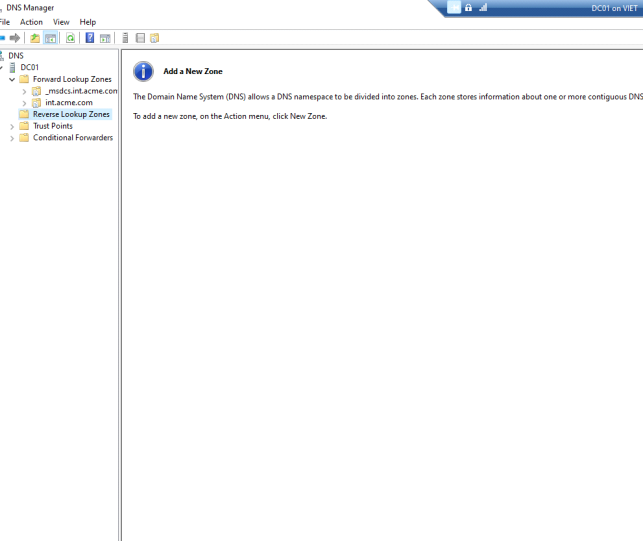{width="10.322916666666666in" height="8.666666666666666in"}

 

Create a reverse lookup zone

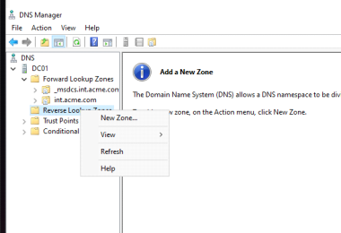{width="6.09375in" height="4.177083333333333in"}

 

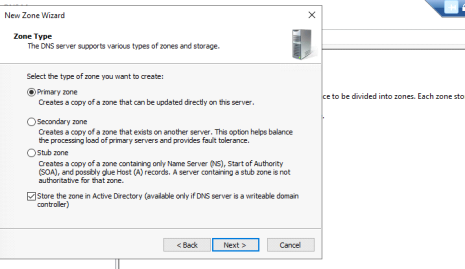{width="7.46875in" height="4.333333333333333in"}

 

 

We now have a replication scope

Replicate my dns with all dns running on DC in this domain

If we add a DC this dns information will be transfer and shared with other domain by default

Click next

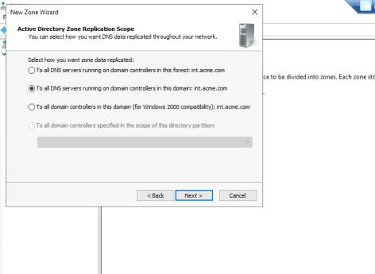{width="7.5625in" height="5.53125in"}

 

 

Click next

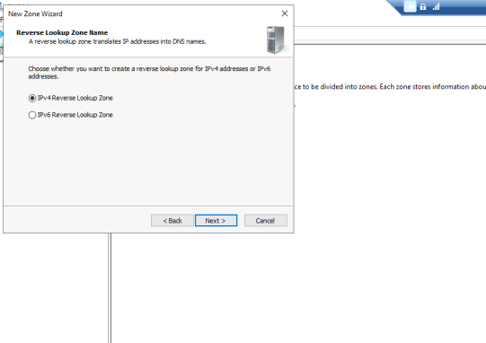{width="8.666666666666666in" height="6.125in"}

 

next

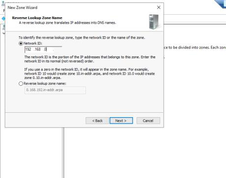{width="7.375in" height="5.8125in"}

 

As machine are added to my AD than record will be added for these in my dns

This is awesome click next

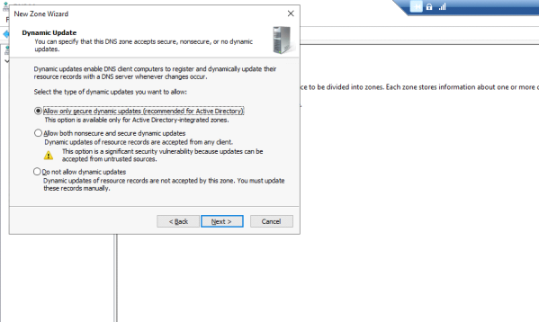{width="9.604166666666666in" height="5.739583333333333in"}

 

Finish

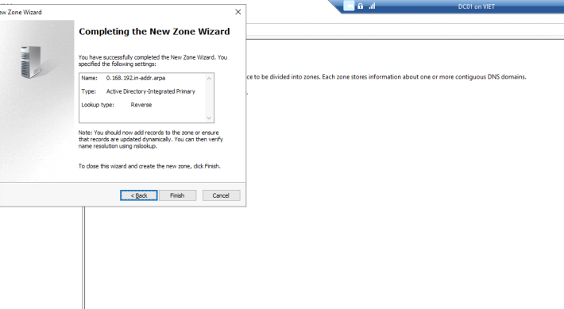{width="11.385416666666666in" height="6.239583333333333in"}

 

 

Click property and verify

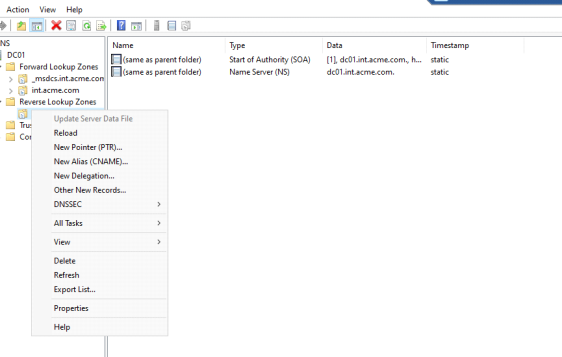{width="9.010416666666666in" height="5.71875in"}

 

 

Successful

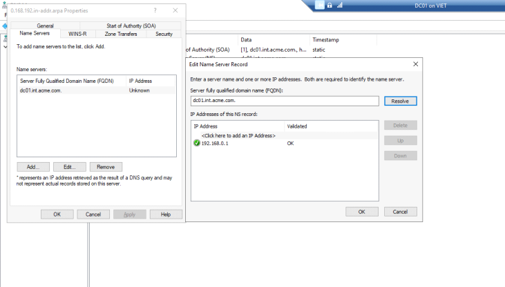{width="11.729166666666666in" height="6.677083333333333in"}

 

 

Update ptr record

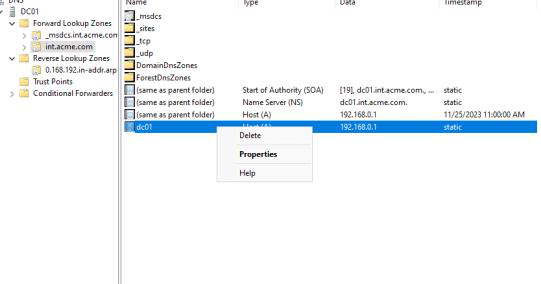{width="8.6875in" height="4.5625in"}

 

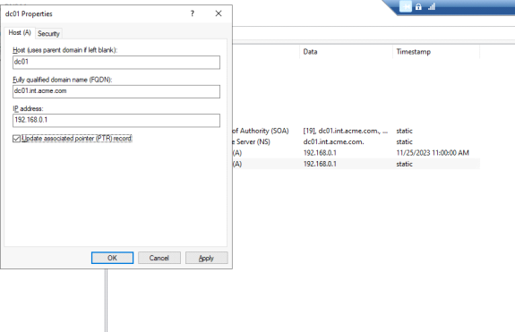{width="9.229166666666666in" height="5.9375in"}

 

 

Validated

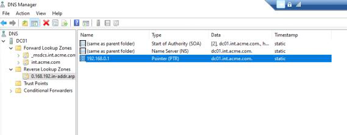{width="9.125in" height="3.5729166666666665in"}

 

 

Now we need DHCP

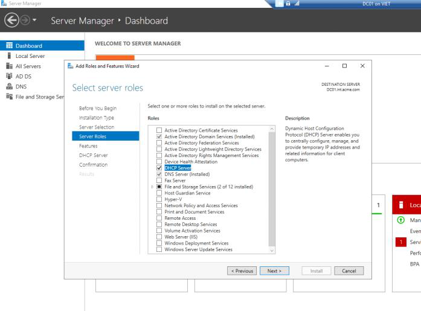{width="11.1875in" height="8.260416666666666in"}

 

 

DHCP is ready to go

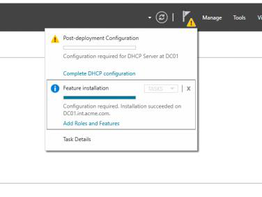{width="6.03125in" height="4.520833333333333in"}

 

 

Complete by creating security group

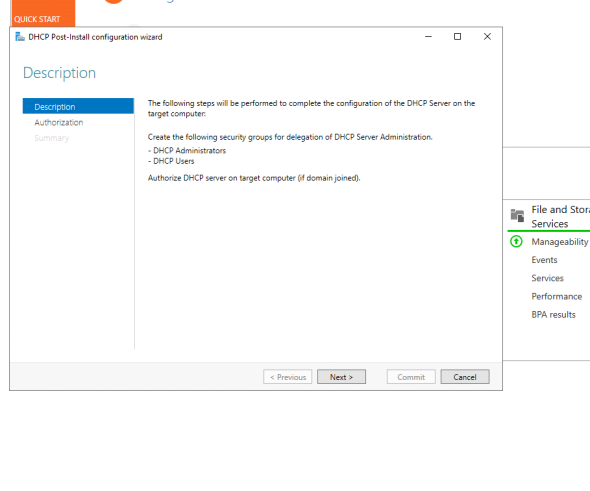{width="9.46875in" height="7.875in"}

 

Important to install after AD cause it will let us use our security credential to manage DHCP

Commit

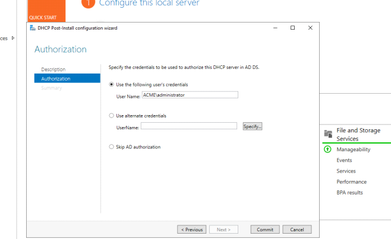{width="10.5625in" height="6.46875in"}

Now we need a scope

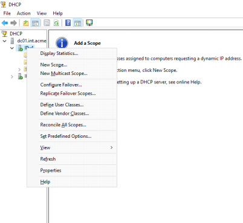{width="6.458333333333333in" height="5.90625in"}

 

 

 

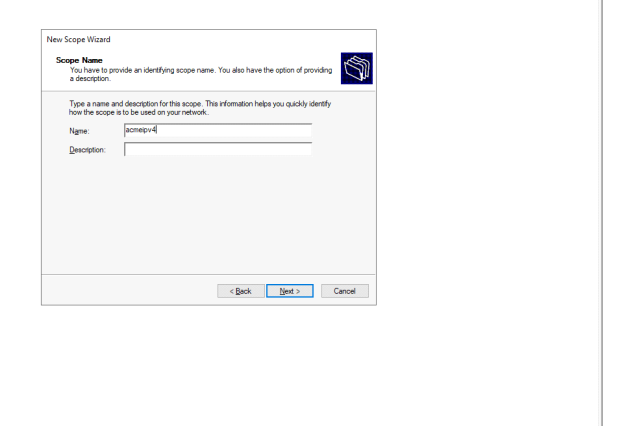{width="10.010416666666666in" height="6.84375in"}

 

Will give us 200 client in our lab

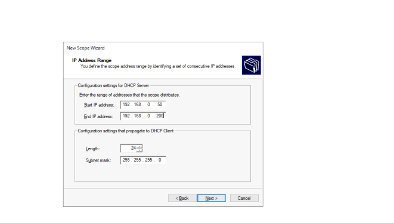{width="10.604166666666666in" height="6.0in"}

 

No exclusion for this lab

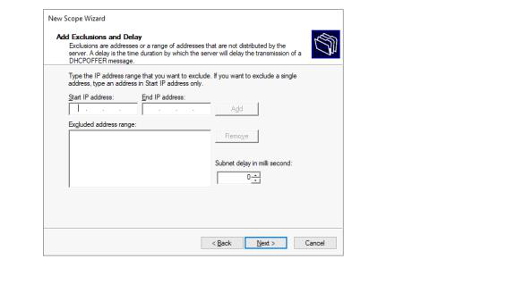{width="9.229166666666666in" height="5.40625in"}

 

 

Regular lease

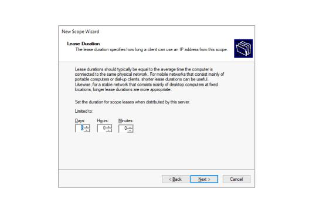{width="8.635416666666666in" height="5.802083333333333in"}

 

Yes

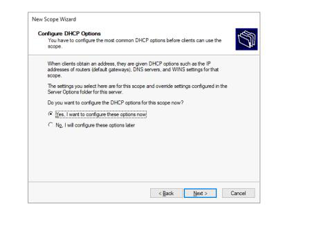{width="7.34375in" height="5.5625in"}

 

Add our gateway

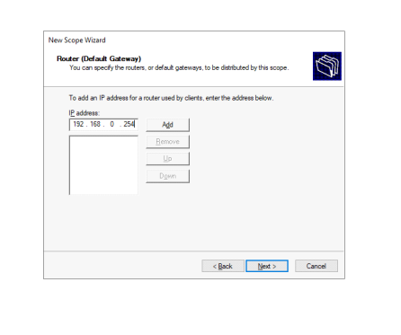{width="7.15625in" height="5.989583333333333in"}

 

Now asking if we want this integration to marry to our parent domain

Recognize that this domain exist so it assume it want us to use our domain controller

Click next

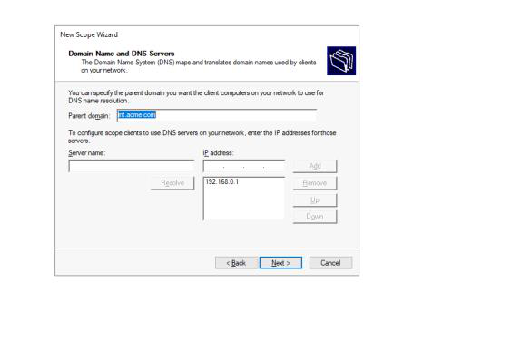{width="9.385416666666666in" height="6.375in"}

 

No WINS

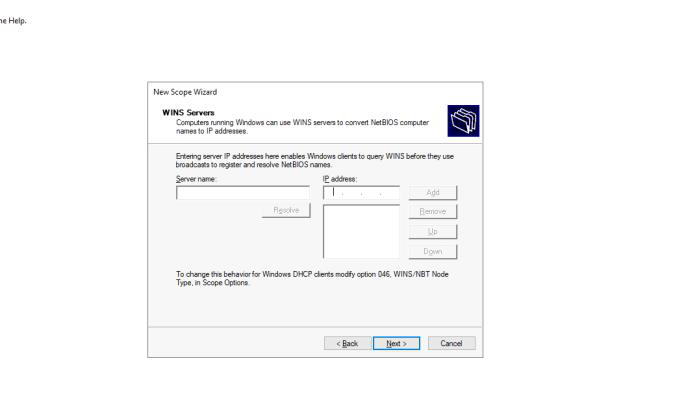{width="11.197916666666666in" height="6.59375in"}

 

Activate this scope

Finish

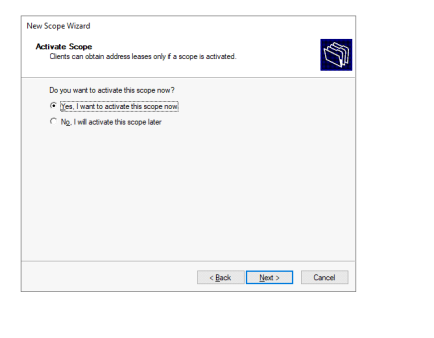{width="6.96875in" height="5.427083333333333in"}

 

 

Now test our client to see if we get dhcp

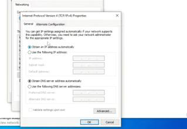{width="5.125in" height="3.53125in"}

 

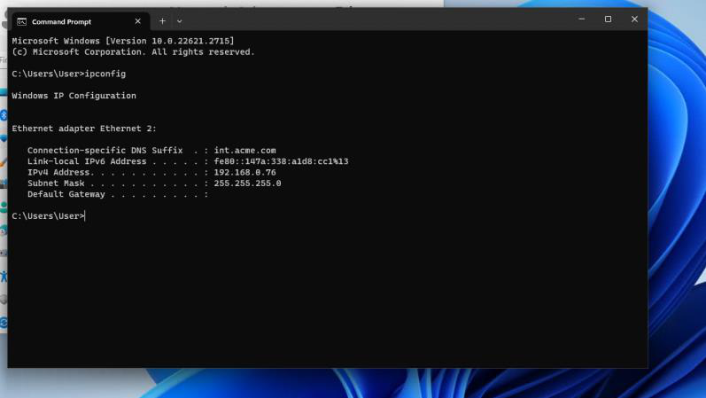{width="12.78125in" height="7.1875in"}

 

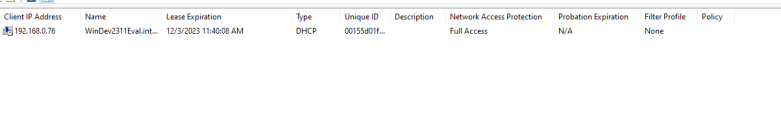{width="12.53125in" height="2.15625in"}

 

Now we need to join client to domain

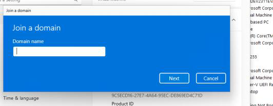{width="8.53125in" height="3.3229166666666665in"}

 

Add cred

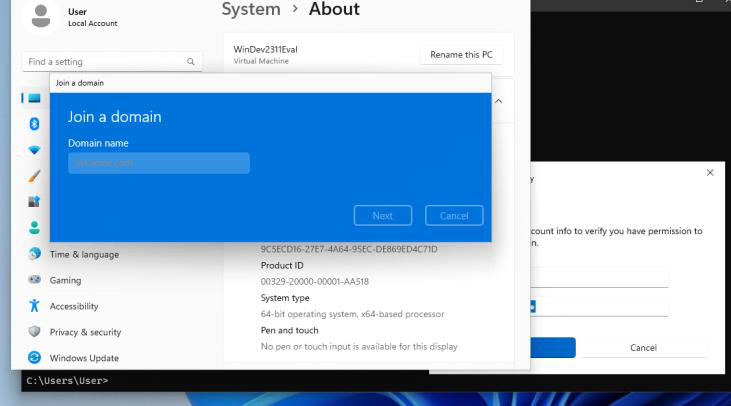{width="11.729166666666666in" height="6.520833333333333in"}

 

Then we can log in but let create a AD user

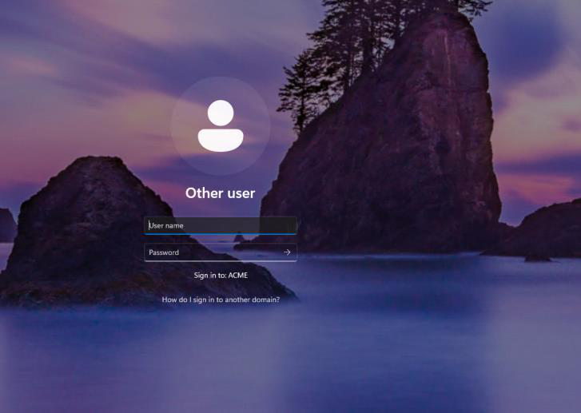{width="11.65625in" height="8.291666666666666in"}

 

On our AD

Go to AD users and computer

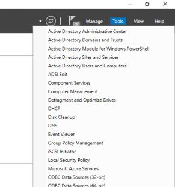{width="4.65625in" height="5.0in"}

 

When we join our client to domain it will put our computer there

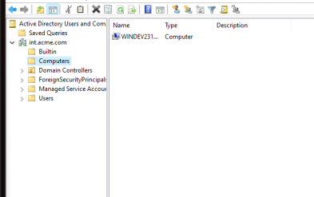{width="6.3125in" height="3.96875in"}

 

We need to create a unique user

We need OU

IT

Staff

Create OU

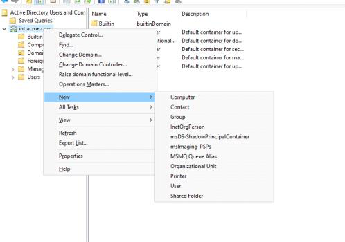{width="7.989583333333333in" height="5.625in"}

 

Remove Protect container from accidental deletion in lab

But in prod its very important

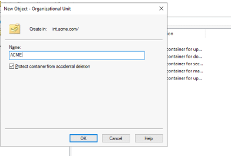{width="6.28125in" height="4.25in"}

 

Now we have our OU

We also need a OU inside of there

For IT and Staff

A nested OU

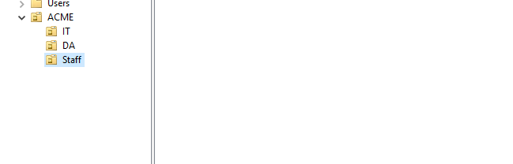{width="6.75in" height="2.1666666666666665in"}

 

Make new IT user

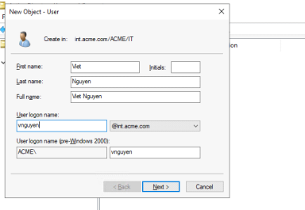{width="6.15625in" height="4.25in"}

 

Create pass

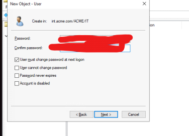{width="6.03125in" height="4.34375in"}

 

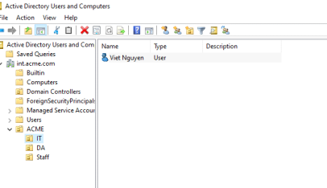{width="6.5in" height="3.7604166666666665in"}

 

Create DA privledge

Usually you make separate account for DA for best practice

 

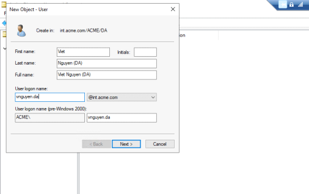{width="8.104166666666666in" height="5.09375in"}

 

Click on property

Member of

Add

 

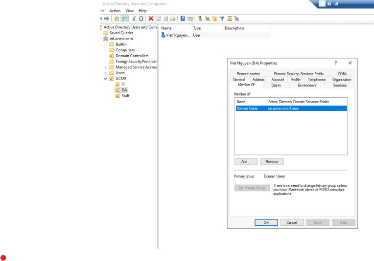{width="12.25in" height="8.572916666666666in"}

 

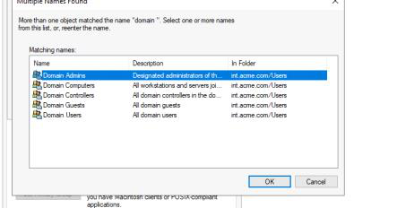{width="7.09375in" height="3.7291666666666665in"}

 

Apply

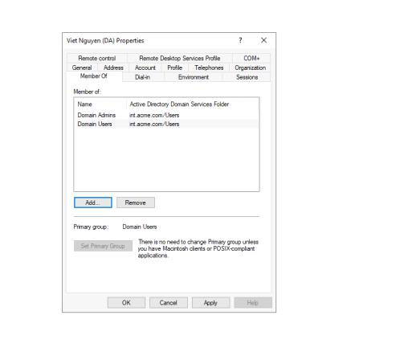{width="7.989583333333333in" height="7.114583333333333in"}

 

Now sign in to your ad join pc
