**Installing a Second Domain Controller in Active Directory Domain Services for Fault Tolerance**

Saturday, November 25, 2023

3:08 PM

 

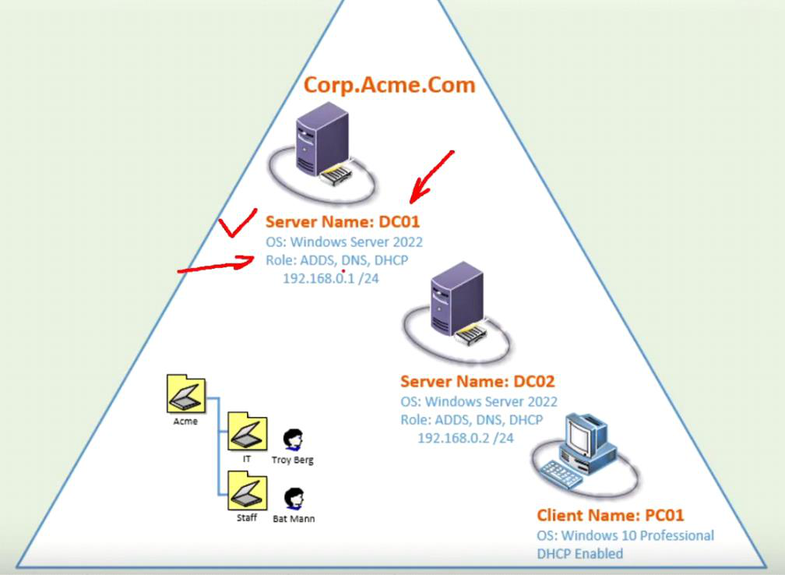{width="11.59375in" height="8.479166666666666in"}

 

Just a simple failover incase primary dc fail

Will allow others to join backup dc

Assign IP

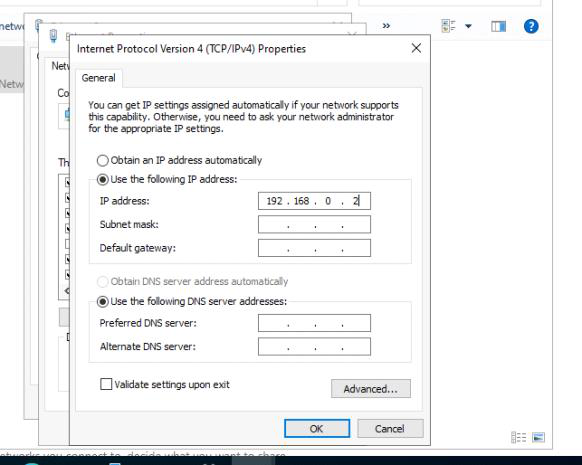{width="6.6875in" height="5.34375in"}

 

Assign computer name

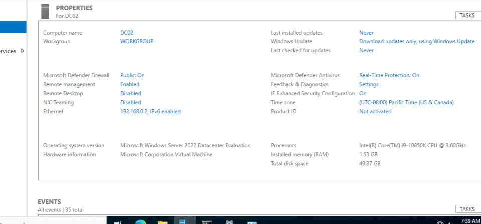{width="11.041666666666666in" height="5.15625in"}

 

Add our AD role and make it a second domain controller for the first

Join domain

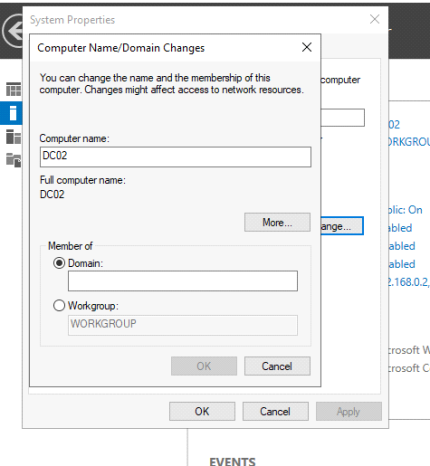{width="4.9375in" height="5.364583333333333in"}

 

Remember dns has to be there to domain join

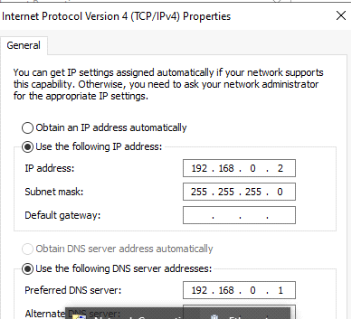{width="4.03125in" height="3.6666666666666665in"}

 

 

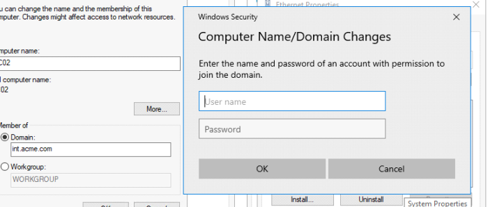{width="8.041666666666666in" height="3.4375in"}

 

Let log in as our domain admin

{width="6.708333333333333in" height="4.9375in"}

 

Let start install our ACDS role

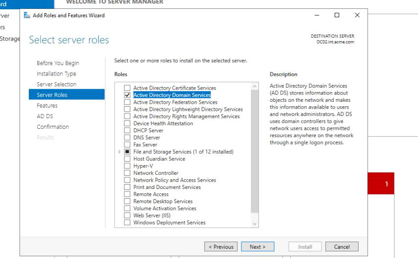{width="9.822916666666666in" height="6.0625in"}

 

Not installing DNS

Install going to do this for ya

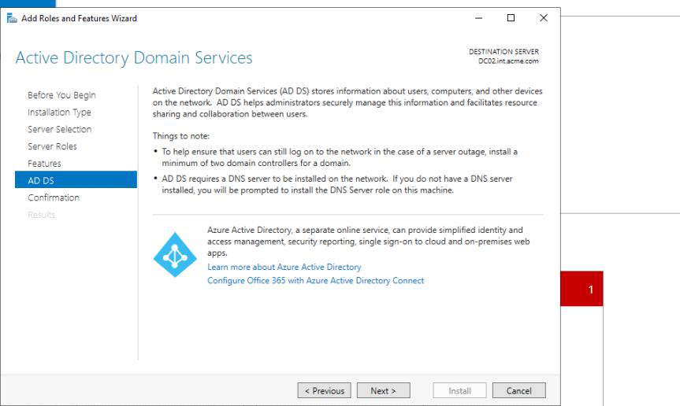{width="9.916666666666666in" height="5.9375in"}

 

 

After install finish

We need to promote to DC

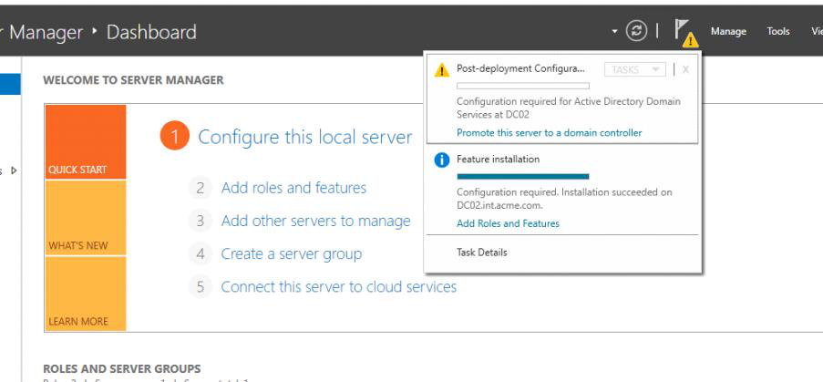{width="10.385416666666666in" height="4.8125in"}

 

This time we will add a domain controller to an existing domain

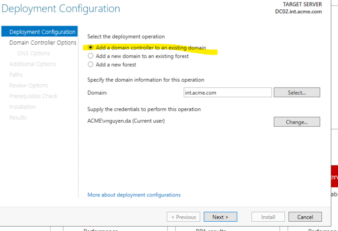{width="7.895833333333333in" height="5.395833333333333in"}

 

GC will have allt he object our dc1 will have

RODC not writing change to dc so it only read information to dc1

Leave read only uncheck

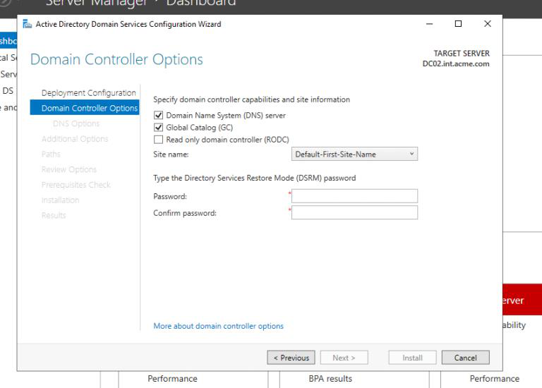{width="8.822916666666666in" height="6.333333333333333in"}

 

Give it a password and next

Wil warn us about not having a DNS

That's fine cause AD will build dns for us

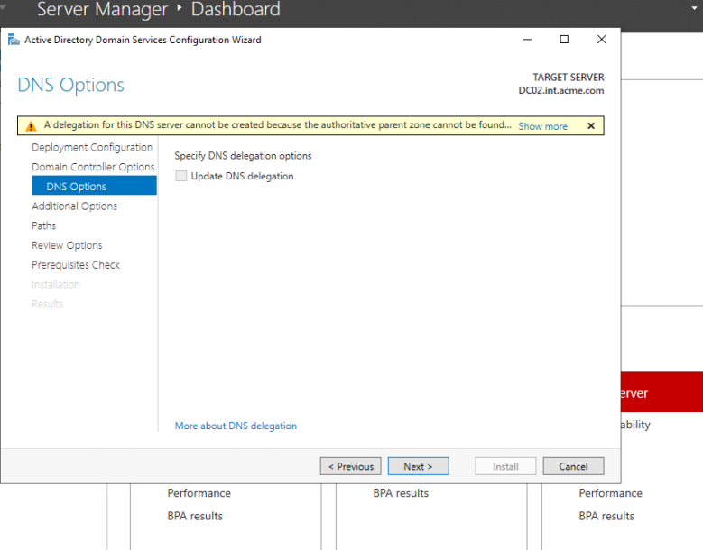{width="8.96875in" height="7.020833333333333in"}

 

 

Pull info from dc01 will replicate it to our dc02

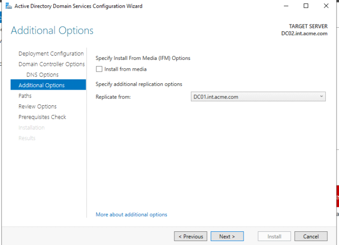{width="8.010416666666666in" height="5.78125in"}

 

Default db stuff next

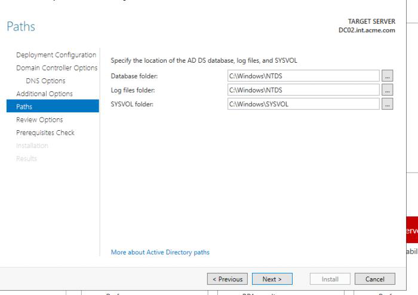{width="8.041666666666666in" height="5.6875in"}

 

Script incase we wanna powershell install

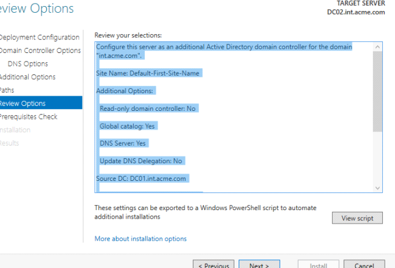{width="7.4375in" height="5.0625in"}

 

 

Pass prereq check

Next

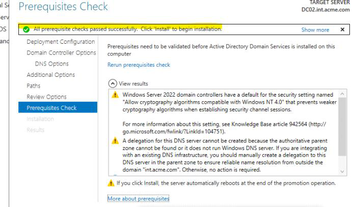{width="8.0in" height="4.6875in"}

 

 

Will reboot after install

Finish

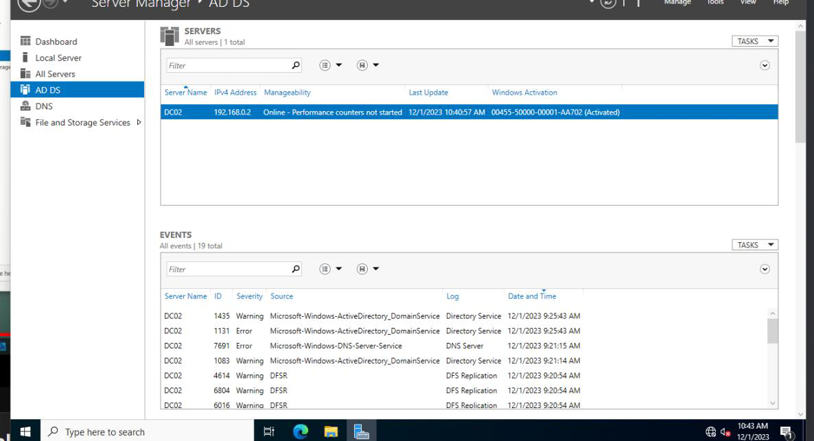{width="13.635416666666666in" height="7.395833333333333in"}

 

 

Go to AD user and computer

Our domain controller is replicated

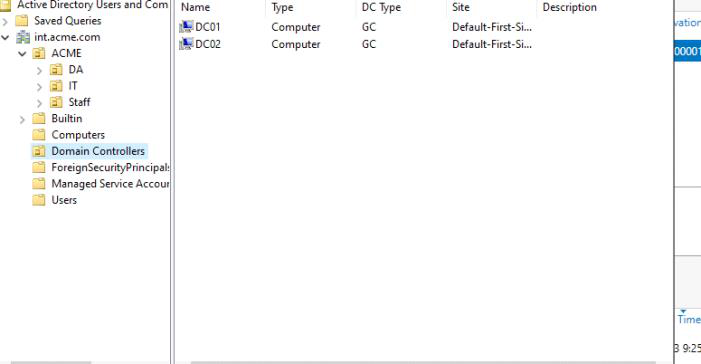{width="8.072916666666666in" height="4.1875in"}

 

Let check DNS

 

Recognize dc02 as a A record

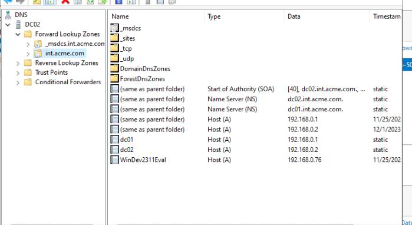{width="8.041666666666666in" height="4.395833333333333in"}

 

Go to properties

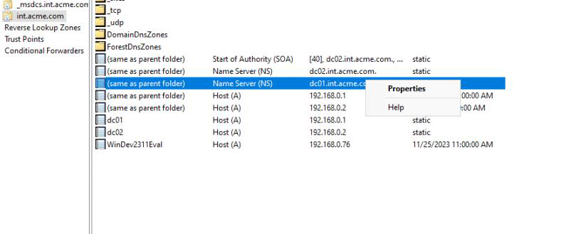{width="9.229166666666666in" height="3.7916666666666665in"}

 

Actually create a ns record for dc02 a fully functional name server

Didn't have to setup dns

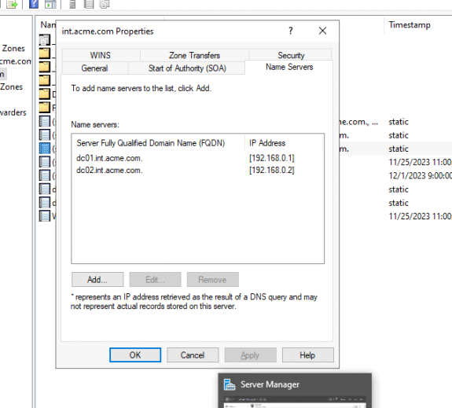{width="6.625in" height="5.96875in"}

 

It also created the reverse lookup zone

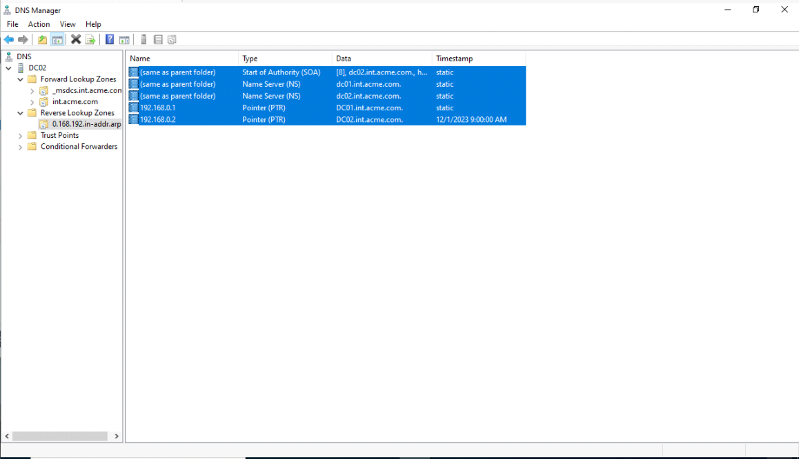{width="13.322916666666666in" height="7.65625in"}

 

 

Test replication

Make a change to dc01 and have it replicate dc02

We can also make a change to dc02 and it will change dc01

 

Made OU for contractor for dc01

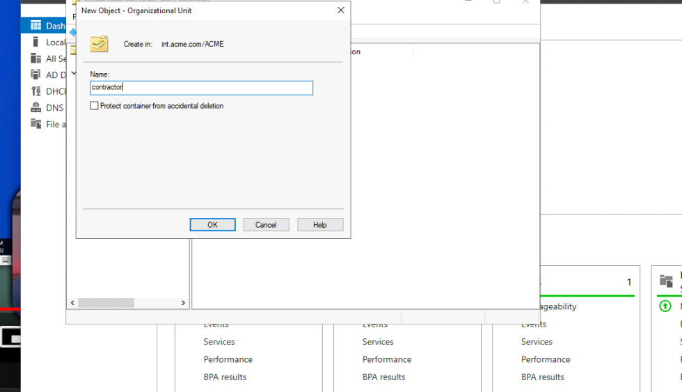{width="11.260416666666666in" height="6.46875in"}

 

 

 

 

We now have contractor on dc02

{width="8.010416666666666in" height="4.53125in"}

 

 

Let create a new contractor on dc01

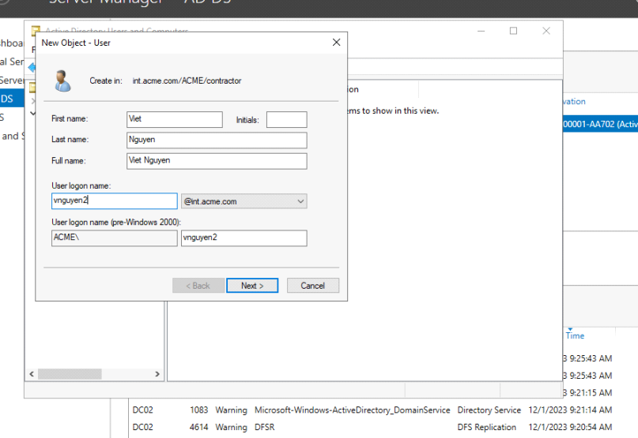{width="9.28125in" height="6.375in"}

 

We got our user on dc01

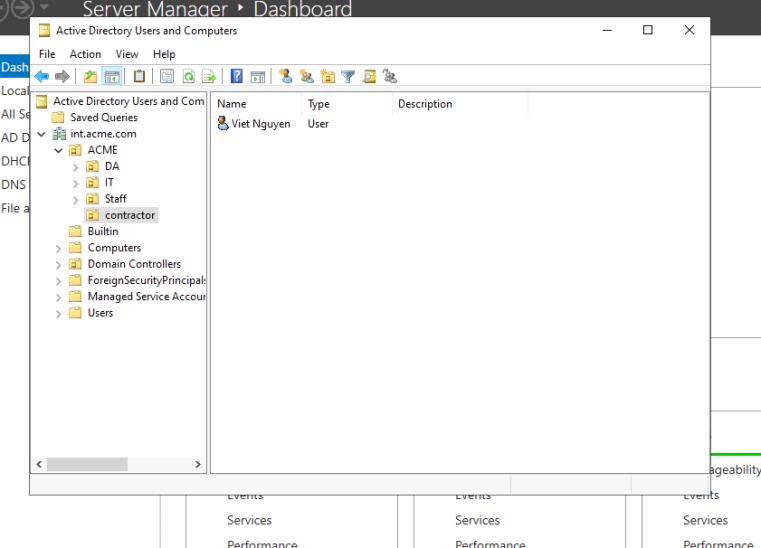{width="8.760416666666666in" height="6.3125in"}

 
